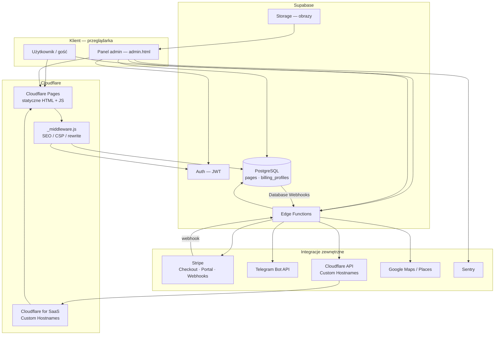

# DFCMS — architektura systemu

> **Ostatnia aktualizacja:** 2026-06-03  
> Uzupełnia [`PROJECT_STATE.md`](PROJECT_STATE.md) (decyzje produktowe) i [`WORKFLOW.md`](WORKFLOW.md) (proces zespołu).

## 1. Podział logiczny

| Warstwa | Odpowiedzialność | Technologie / artefakty |
|--------|------------------|-------------------------|
| **Frontend (public + panel)** | Landing, szablony branżowe, panel CMS, routing wielodomenowy | Statyczne HTML, `js/` (Alpine.js w panelu), `css/styles.css`, `js/core/config.js` |
| **Hosting frontu** | CDN, preview deployów, custom hostnames klientów (SaaS) | **Cloudflare Pages** (`functions/_middleware.js` — SEO, CSP, proxy treści) |
| **Backend / baza** | Auth, treść stron, rozliczenia, storage | **Supabase** — PostgreSQL (`pages`, `billing_profiles`), Auth (JWT), Storage, RLS |
| **Funkcje serverless** | Płatności, domeny, cron trial, opinie Google, alerty | **Supabase Edge Functions** (Deno) w `supabase/functions/` |
| **Płatności** | Checkout, Customer Portal, webhooks | **Stripe** (Test na Staging, Live na Production) |
| **DNS / domeny klientów** | Custom Hostnames w strefie Cloudflare | **Cloudflare for SaaS** — Edge `add-custom-domain` (`CF_ZONE_ID`, `CF_API_TOKEN`) |
| **Observability** | Błędy panelu, alerty operacyjne | **Sentry** (panel), **Telegram** (`telegram-webhook` + Database Webhooks) |

## 2. Środowiska (Staging / Production)

| Środowisko | Git (typowo) | Frontend | Supabase (`project-ref`) | Stripe |
|------------|--------------|----------|---------------------------|--------|
| **Staging** | `staging` | `staging.dfcms.pl`, preview `*.pages.dev` | `asxrsdsprrbvjvgcsckh` | **Test mode** — klucze i ceny testowe w Secrets |
| **Production** | `main` | `dfcms.pl`, subdomeny `{slug}.dfcms.pl` | `tawywecinkubmouyprab` | **Live mode** — osobne Secrets i Price ID |

Przed `supabase link`, `db push` lub `functions deploy` **zawsze** sprawdź, do którego projektu jest podłączony CLI (`supabase projects list` / Dashboard).

Separacja jest **zakończona**: dwa niezależne projekty Supabase, osobne sekrety Edge, osobne webhooki Stripe, osobne zmienne Cloudflare Pages na produkcję vs staging.

**Front (`js/core/config.js`):** bez bundlera — wybór projektu po **hostname** (localhost / `staging.dfcms.pl` / `*.pages.dev` → Staging; reszta → Production). Lokalny `npm run dev` nie używa Dockera.

## 3. Przepływ danych (diagram)

### Kluczowe ścieżki

1. **Rejestracja / edycja** — przeglądarka → Supabase Auth + PostgREST (`pages`, `draft_content` / `content`) z kluczem **anon** (RLS).
2. **Publikacja treści** — panel kopiuje `draft_content` → `content`; strony publiczne czytają wyłącznie `content` (preview: `dfcms_preview=1` + właściciel).
3. **Płatność** — panel → `create-checkout` → Stripe Checkout → `stripe-webhook` / `sync-stripe-subscription` → `billing_profiles` + lustrzane `pages.billing_plan`.
4. **Własna domena** — panel → `add-custom-domain` → Cloudflare Custom Hostname → `pages.custom_domain` → ruch klienta przez Pages + middleware.
5. **Alerty** — Sentry / Database Webhooks / logi → `telegram-webhook` → Telegram (bez triggerów SQL `http_request` w migracjach).

## 4. Edge Functions (indeks)

| Funkcja | Rola |
|---------|------|
| `create-checkout` | Sesja Stripe Checkout (plan, interval) |
| `create-portal-session` | Stripe Customer Portal |
| `stripe-webhook` | Zdarzenia Stripe → `billing_profiles` + `pages` |
| `sync-stripe-subscription` | Ręczna synchronizacja statusu subskrypcji |
| `add-custom-domain` | Cloudflare Custom Hostname + zapis w DB |
| `get-google-reviews` | Places / opinie (klucz tylko na Edge) |
| `expire-trial-pages` | Cron — blokada trialu + purge |
| `telegram-webhook` | Router alertów → Telegram |

Współdzielona logika Stripe: `supabase/functions/_shared/stripeBilling.ts`.

## 5. Powiązane dokumenty

- [`PROJECT_STATE.md`](PROJECT_STATE.md) — stan produktu, Stripe, onboarding, security  
- [`WORKFLOW.md`](WORKFLOW.md) — development, migracje, deploy  
- [`README.md`](README.md) — szybki start i struktura katalogów  
- [`docs/LIVING_CONTEXT.md`](docs/LIVING_CONTEXT.md) — changelog skrótowy  
