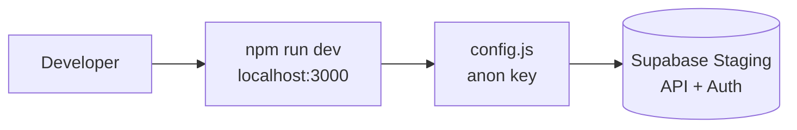
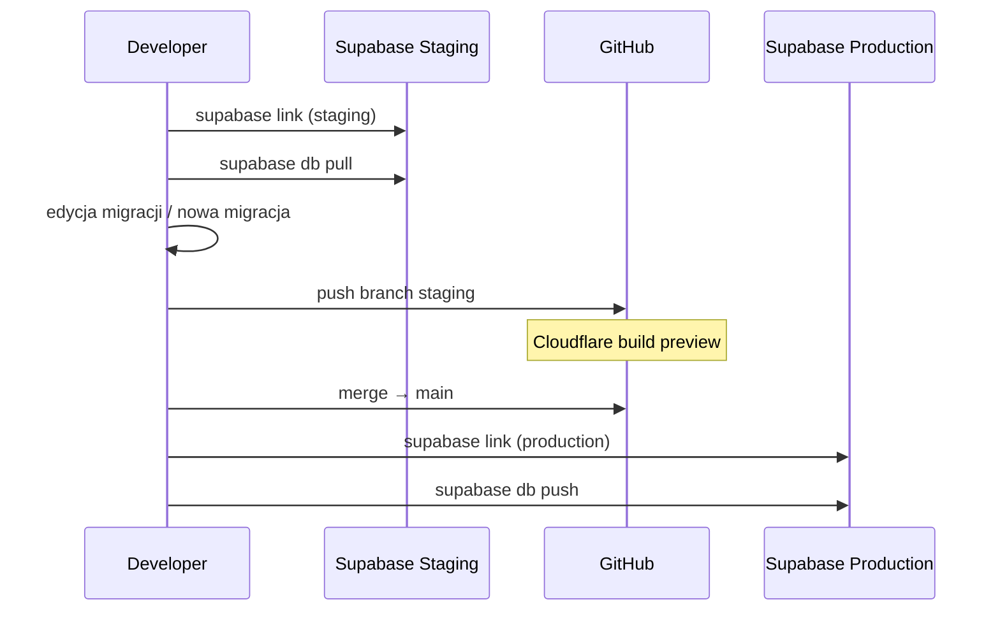
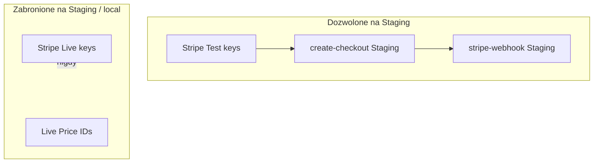
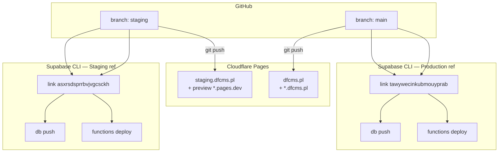

# DFCMS — workflow zespołu

> **Biblia onboardingu** dla nowych programistów.  
> **Ostatnia aktualizacja:** 2026-06-03 (config.js → chmurowy Staging na localhost)

## Mapa dokumentów

| Potrzebujesz… | Plik |
|---------------|------|
| Architektura i diagram przepływu | [`ARCHITECTURE.md`](ARCHITECTURE.md) |
| Decyzje produktowe, Stripe, security | [`PROJECT_STATE.md`](PROJECT_STATE.md) |
| Changelog jednoliniowy | [`docs/LIVING_CONTEXT.md`](docs/LIVING_CONTEXT.md) |
| Struktura repo, skrót deploy | [`README.md`](README.md) |

---

## 1. Lokalny development

### Wymagania

- Node.js 18+ (do `npm run dev`)
- [Supabase CLI](https://supabase.com/docs/guides/cli) — **bez** lokalnego Dockera (`supabase start` **nie** używamy)
- Konto Supabase z dostępem do projektu **Staging**

### Uruchomienie frontu

```bash
npm install
npm run dev
```

Serwer statyczny nasłuchuje na **http://localhost:3000** (pakiet `serve`).

Alternatywy: `python3 -m http.server 3000`, Live Server w IDE — ważne, żeby origin był `http://`, **nie** `file://`.

### Supabase bez Dockera (chmura Staging)

Lokalny development **nie** używa `supabase start` ani `127.0.0.1:54321`. Po `npm run dev` przeglądarka na **localhost** łączy się z **projektem Supabase Staging** (`asxrsdsprrbvjvgcsckh`) — ta sama baza, na której testujesz migracje i Edge po `supabase link` + `db push` / `functions deploy`.

Wymagania po stronie Supabase Staging:

- W **Authentication → URL Configuration** dodaj redirecty: `http://localhost:3000/admin.html`, ewentualnie `http://127.0.0.1:3000/admin.html`.
- Edge Secrets i Stripe **Test** muszą być ustawione na projekcie Staging (CLI).

### Jak `config.js` wybiera bazę (routing po hoście)

Repozytorium to **statyczny JS bez Vite** — wartości nie pochodzą z `import.meta.env` w runtime. Zamiast tego **`js/core/config.js`** mapuje **hostname** na Staging lub Production:

| Host | Środowisko Supabase | `deployEnvironment` |
|------|---------------------|---------------------|
| `localhost`, `127.0.0.1` | **Staging** | `staging` |
| `staging.dfcms.pl` | **Staging** | `staging` |
| `*.pages.dev` (Cloudflare Preview) | **Staging** | `staging` |
| `dfcms.pl`, `www.dfcms.pl`, `{slug}.dfcms.pl`, domeny klientów | **Production** | `production` |

Stałe w pliku (`SUPABASE_URL_STAGING` / `SUPABASE_URL_PRODUCTION`) odpowiadają lokalnym plikom **`.env.development`** / **`.env.production`** (tylko dokumentacja zespołu — **nie** są wczytywane przez przeglądarkę).

W konsoli devtools: `window.DFOPS_DEPLOY_ENVIRONMENT` → `'staging'` | `'production'`.

**Cloudflare Pages (`functions/_middleware.js`):** osobno ustaw `SUPABASE_URL` i `SUPABASE_ANON_KEY` w zmiennych Pages — dla środowiska Production wartości z `.env.production`, dla Preview/Staging z `.env.development`, żeby middleware SEO/custom domain trafiał w ten sam projekt co front.

Pliki **`.env*`** — w **`.gitignore`**; nie commituj sekretów (service role, Stripe secret).

### Zasady lokalne

- Nie otwieraj `admin.html` z dysku (`file://`) — Auth i Edge wymagają HTTP(S).
- Po zmianach w panelu podbij `?v=` w `admin.html` / szablonach, jeśli CDN cacheuje stare JS.
- Demo bez wiersza w bazie: slugi `demo-*` z **`docs/demo_seeds.json`** (tylko localhost).



---

## 2. Baza danych (Supabase CLI)

### Przełączanie projektu (`project-ref`) — obowiązkowe

Supabase CLI trzyma **jeden** aktywny link na raz. Przed `db push`, `functions deploy` lub `secrets set` musisz wskazać właściwy projekt:

| Cel | `project-ref` | Gałąź Git (front) | Komenda link |
|-----|---------------|-------------------|--------------|
| **Staging** | `asxrsdsprrbvjvgcsckh` | `staging` | `npm run supabase:link:staging` |
| **Production** | `tawywecinkubmouyprab` | `main` | `npm run supabase:link:production` |

Sprawdź, co jest podłączone: `npm run supabase:linked` (albo `cat supabase/.temp/project-ref`).

**Typowy błąd:** po pracy na Stagingu zostaje link stagingowy, a potem `db push` na produkcję bez przełączenia — migracja leci na złą bazę. Zawsze: **link → push/deploy → git push** na tę samą warstwę.

Skróty (link + operacja w jednym kroku):

```bash
npm run deploy:db:staging
npm run deploy:functions:staging
git push origin staging

# po merge / premierze:
npm run deploy:db:production
npm run deploy:functions:production
git push origin main
```

`git push` **nie** przełącza projektu Supabase — to tylko Cloudflare Pages. CLI i Git są **niezależne**.

### Filozofia

| Robimy | Nie robimy |
|--------|------------|
| `supabase link` do **Staging** przy codziennej pracy | `supabase start` (Docker lokalny) |
| `supabase db pull` — schemat ze Stagingu | Ręczne grzebanie w prod SQL Editor bez migracji |
| Nowe zmiany jako pliki w `supabase/migrations/` | Triggerów `supabase_functions.http_request` w migracjach |
| `supabase db push` na **Production** po review | Push migracji na prod „z palca” bez gałęzi `main` |

### Typowy cykl

```bash
# 1. Podłącz Staging (project-ref: asxrsdsprrbvjvgcsckh)
supabase link --project-ref asxrsdsprrbvjvgcsckh

# 2. Pobierz aktualny schemat zdalny → nowy plik w supabase/migrations/
supabase db pull

# 3. Ręcznie oczyść dump (np. usuń triggery http_request / webhook SQL)

# 4. Commit migracji na gałąź staging → testy na staging.dfcms.pl

# 5. Po merge do main — link Production i push
supabase link --project-ref tawywecinkubmouyprab
supabase db push
```

**Production** `project-ref`: `tawywecinkubmouyprab`.

Nazwy migracji: `<timestamp>_opis.sql` (np. `20260603072317_remote_schema.sql`).



### Database Webhooks (Telegram)

Alerty biznesowe (nowy user, strona, billing) konfiguruj w **Dashboard → Database Webhooks** → URL `…/functions/v1/telegram-webhook`. **Nie** commituj triggerów SQL z `http_request`.

---

## 3. Testowanie płatności (Stripe)

### Zasady bezwzględne

1. **Zakaz** kluczy **Stripe LIVE** (`sk_live_`, webhook signing secret live) na Stagingu, localhost i w testowych Secrets Supabase Staging.
2. Testy Checkout / Portal / webhooków wyłącznie w **Stripe Test mode** na projekcie **Staging**.
3. Ceny testowe: Secrets `STRIPE_PRICE_*` w Supabase Staging + fallback `stripePrices` w `config.js` — ID z Dashboard Stripe **Test**.
4. Webhook testowy w Stripe wskazuje na Edge Staging: `https://asxrsdsprrbvjvgcsckh.supabase.co/functions/v1/stripe-webhook` (lub aktualny URL projektu).
5. Przed merge na `main` sprawdź, że na Production Secrets mają **Live** Price ID i osobny endpoint webhooka Live.

### Karty testowe

Używaj [kart testowych Stripe](https://docs.stripe.com/testing) (np. `4242 4242 4242 4242`) — nigdy prawdziwej karty na Stagingu „dla pewności”.



---

## 4. Wdrożenie (deploy)



### Frontend (Cloudflare Pages)

| Akcja | Efekt |
|-------|--------|
| `git push origin staging` | Build **staging** — `staging.dfcms.pl`, automatyczne **preview** dla PR |
| `git push origin main` | Build **production** — apex `dfcms.pl` |

W projekcie Pages ustaw zmienne (per environment): `SUPABASE_URL`, `SUPABASE_ANON_KEY` — zgodne z docelowym projektem Supabase.

Middleware: `functions/_middleware.js`.

### Baza (Production)

Po merge do `main` i review migracji:

```bash
supabase link --project-ref tawywecinkubmouyprab
supabase db push
```

### Edge Functions

Deploy na **aktualnie zlinkowany** projekt:

```bash
# wszystkie funkcje
supabase functions deploy

# lub pojedynczo
supabase functions deploy stripe-webhook
supabase functions deploy telegram-webhook
```

**Staging:** `link` → staging → `functions deploy` + `secrets set` (Test Stripe, CF token staging, Telegram, …).  
**Production:** `link` → production → `functions deploy` + secrets Live.

Sekrety: `supabase secrets set NAZWA=wartość` — nigdy w repo.

### Checklist przed release na Production

- [ ] Migracje przetestowane na Staging (`db push` staging)
- [ ] Edge Functions wdrożone na Production
- [ ] Secrets Production = Live Stripe + prod CF + prod webhook URLs
- [ ] Cloudflare Pages (main) wskazuje prod Supabase
- [ ] Stripe Dashboard: webhook Live → prod `stripe-webhook`
- [ ] Database Webhooks → `telegram-webhook` (jeśli używane)

---

## 5. Gałęzie Git (skrót)

| Gałąź | Cel |
|-------|-----|
| `staging` | Integracja, QA, Stripe Test, Supabase Staging |
| `main` | Produkcja — Cloudflare prod + Supabase Production |

Feature branch → PR do `staging` → po akceptacji merge do `main`.

---

## 6. Kontakt i bezpieczeństwo

- **Service role**, `STRIPE_SECRET_KEY`, tokeny Cloudflare, Telegram — tylko Supabase Secrets / zmienne CI, **nigdy** w commitach.
- Przy wątpliwościach którego projektu dotyczy CLI: `cat supabase/.temp/project-ref` lub Dashboard URL.
