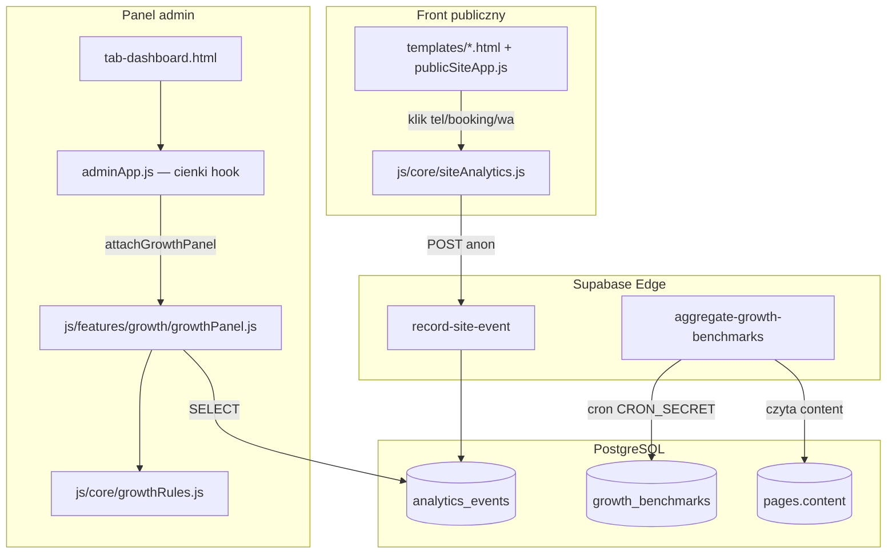

# DFCMS — Silnik Wzrostu (Growth Autopilot)

> **Spec wdrożeniowy dla agentów.** Stan produkcji i konwencje repo: [`MASTER_CONTEXT.md`](MASTER_CONTEXT.md).  
> **Cel produktu:** CMS, który po publikacji strony co tydzień podpowiada **jedną** konkretną zmianę związaną z klientami (telefon, rezerwacja, opinie), a nie kolejny wykres odwiedzin.

**Ostatnia aktualizacja:** 2026-07-04 (v2 — repurposing `analytics_events`, bez `site_events`)

---

## 1. Kontekst i granice

### 1.1 Co to jest (i czym nie jest)

| Silnik Wzrostu **jest** | Silnik Wzrostu **nie jest** |
|-------------------------|----------------------------|
| Priorytet tygodnia + liczniki konwersji (telefon, rezerwacja, WhatsApp) | Kolejny edytor treści / page builder |
| Reguły branżowe per `pages.theme` (jak `themeConfig`) | Generyczny AI „napisz posta” |
| Benchmarki anonimowe z bazy tenantów | Google Analytics w panelu |
| CTA „Przejdź i uzupełnij” → istniejąca zakładka panelu | Auto-publikacja bez zgody użytkownika |

### 1.2 Relacja do istniejących modułów

```
┌─────────────────────────────────────────────────────────────────┐
│  dashboardStartTasks (adminApp.js)                              │
│  → kompletność profilu (telefon, oferta, baner) — BEZ ZMIAN    │
└─────────────────────────────────────────────────────────────────┘
                              │
                              ▼
┌─────────────────────────────────────────────────────────────────┐
│  growthWeeklyPriority (NOWE)                                    │
│  → skuteczność + benchmark branżowy + 1 rekomendacja / tydzień  │
└─────────────────────────────────────────────────────────────────┘
```

- **`analytics_events`** — **jedyna tabela zdarzeń** (repurpose). Stary tracking panelu (onboarding, checkout) był nieudany i **nie będzie używany** — w G1 usunąć wywołania `DFOPS_trackEvent` z `adminApp.js` i rozszerzyć schemat pod konwersje publiczne (klik tel, rezerwacja, WhatsApp).
- **`themeConfig.js`** — źródło prawdy sekcji motywu; reguły wzrostu **muszą** wołać `DFOPS_themeHasSection`, nie `theme === 'beauty'`.
- **`pages.content` / `draft_content`** — treść + opcjonalny stan UI rekomendacji w `pl.settings.growth`.
- **Panel JS** — monolit `js/features/adminApp.js`; **Silnik Wzrostu** jako **pierwszy wycinek** w `js/features/growth/` (patrz §14). HTML w `admin/partials/` → `npm run build:admin`.

### 1.3 Fazy wdrożenia (kolejność obowiązkowa)

| Faza | Nazwa | DoD (skrót) |
|------|-------|-------------|
| **G0** | Kontrakt + reguły (bez DB) | `growthRules.js`, testy kontekstu, mock karty na dashboardzie |
| **G1** | Zdarzenia publiczne | migracja `analytics_events`, Edge `record-site-event`, hooki w szablonach, cleanup panel telemetry |
| **G2** | Benchmarki | RPC `aggregate_growth_benchmarks`, cron Edge, tabela `growth_benchmarks` |
| **G3** | Panel — priorytet tygodnia | karta na `tab-dashboard.html`, moduł `js/features/growth/`, cienki hook w `adminApp.js` |
| **G4** | One-click draft (opcjonalnie) | `applyGrowthPatch()` → `draft_content`, bez auto-publish |

---

## 2. Diagram przepływu danych



---

## 3. Warstwa danych (PostgreSQL)

### 3.1 Rozszerzenie `analytics_events` (zamiast nowej tabeli)

**Plik migracji:** `supabase/migrations/<timestamp>_growth_analytics_events.sql`

```sql
-- Repurpose analytics_events → konwersje publiczne (Silnik Wzrostu)
-- Stare wiersze panelu: event_scope = 'legacy' (domyślnie po migracji)

ALTER TABLE public.analytics_events
  ALTER COLUMN user_id DROP NOT NULL;

ALTER TABLE public.analytics_events
  ADD COLUMN IF NOT EXISTS page_id bigint REFERENCES public.pages(id) ON DELETE CASCADE,
  ADD COLUMN IF NOT EXISTS slug text,
  ADD COLUMN IF NOT EXISTS source text,
  ADD COLUMN IF NOT EXISTS visitor_key text,
  ADD COLUMN IF NOT EXISTS event_scope text NOT NULL DEFAULT 'legacy';

-- created_at: jeśli w baseline bez time zone — opcjonalnie:
-- ALTER COLUMN created_at TYPE timestamptz USING created_at AT TIME ZONE 'UTC';

CREATE INDEX IF NOT EXISTS analytics_events_page_created_idx
  ON public.analytics_events (page_id, created_at DESC)
  WHERE page_id IS NOT NULL AND event_scope = 'conversion';

CREATE INDEX IF NOT EXISTS analytics_events_slug_created_idx
  ON public.analytics_events (slug, created_at DESC)
  WHERE event_scope = 'conversion';

COMMENT ON COLUMN public.analytics_events.event_name IS
  'Typ zdarzenia: conversion → phone_click, booking_click, …; legacy → onboarding_* (deprecated)';
COMMENT ON COLUMN public.analytics_events.event_scope IS
  'conversion = klik CTA na stronie publicznej; legacy = stary telemetry panelu (nieużywany)';
```

**Opcjonalnie w tej samej migracji** (decyzja operacyjna na Stagingu):

```sql
-- DELETE FROM public.analytics_events WHERE event_scope = 'legacy';
-- lub TRUNCATE public.analytics_events;  -- tylko jeśli potwierdzisz brak wartości historycznej
```

**Kolumna `event_name`** — bez rename (mniej churnu w RLS/grantach). Dla Silnika Wzrostu traktuj ją jako **`event_type`**:

| `event_name` | Opis |
|--------------|------|
| `phone_click` | `tel:` w hero, stopce, nav |
| `booking_click` | CTA rezerwacji / `#rezerwacja` / link Booksy |
| `whatsapp_click` | FAB szybkiego kontaktu / `wa.me` |
| `messenger_click` | FAB Messenger |
| `email_click` | `mailto:` |
| `map_click` | link do mapy / Google Maps |

**Nowy wiersz konwersji:**

```json
{
  "user_id": null,
  "page_id": 123,
  "slug": "salon-anna",
  "event_name": "phone_click",
  "event_scope": "conversion",
  "source": "hero",
  "visitor_key": "…",
  "created_at": "…"
}
```

**Katalog `source` (opcjonalny):** `hero`, `nav`, `footer`, `booking_section`, `fab`, `contact`.

**`visitor_key`:** hash dzienny po stronie Edge — **bez PII**; może być `NULL` w v0.

**Zapytania Silnika Wzrostu** — zawsze filtruj:

```sql
WHERE event_scope = 'conversion' AND page_id = $1
```

### 3.2 Tabela `growth_benchmarks`

**Plik migracji:** ten sam lub `<timestamp>_growth_benchmarks.sql`

```sql
CREATE TABLE public.growth_benchmarks (
  theme text NOT NULL,
  metric_key text NOT NULL,
  value numeric NOT NULL,
  sample_size int NOT NULL DEFAULT 0,
  computed_at timestamptz NOT NULL DEFAULT timezone('utc', now()),
  PRIMARY KEY (theme, metric_key)
);
```

**Przykładowe `metric_key`:**

| Klucz | Znaczenie |
|-------|-----------|
| `pct_has_phone` | % stron z niepustym `content.pl.contact.phone` |
| `pct_has_booking_url` | % z aktywną rezerwacją (`booking_mode` ≠ pusty flow) |
| `pct_has_google_reviews` | % z podpiętym `place_id` |
| `pct_has_hero_image` | % z `hero.image` lub `nav.logoImage` |
| `pct_has_offer` | % z ≥1 usługą / pozycją menu (zależnie od motywu) |
| `median_weekly_phone_clicks` | mediana kliknięć tel / 7 dni (tylko strony z ≥7 dniami danych) |

### 3.3 RLS i granty

Wzorzec: [`20260617221000_harden_pages_public_select.sql`](../../supabase/migrations/20260617221000_harden_pages_public_select.sql) + God Mode (już na `analytics_events`).

**Zmiany RLS na `analytics_events`:**

1. **Usunąć** lub zastąpić politykę `"Zezwalaj na insert tylko swoich zdarzen"` — panel **nie insertuje** już bezpośrednio (G1).
2. **INSERT:** tylko `service_role` (Edge `record-site-event`). `anon` / `authenticated` **bez** bezpośredniego INSERT konwersji.
3. **SELECT `authenticated`:** wiersze gdzie `event_scope = 'conversion'` **oraz** `page_id` należy do strony użytkownika:

```sql
CREATE POLICY analytics_events_owner_select_conversion
ON public.analytics_events FOR SELECT TO authenticated
USING (
  event_scope = 'conversion'
  AND page_id IN (SELECT id FROM public.pages WHERE user_id = auth.uid())
);
```

4. **Superadmin:** istniejące polityki OR (`analytics_events_superadmins_select`) — bez zmian.
5. **`legacy` wiersze:** brak SELECT dla ownera (nieużywane); superadmin nadal widzi wszystko.

**`growth_benchmarks`:** bez zmian (SELECT authenticated, INSERT/UPDATE service_role).

**Nie dodawać** triggerów SQL z `http_request` (reguła repo).

### 3.4 RPC `aggregate_growth_benchmarks()`

**SECURITY DEFINER**, `SET search_path = public`, wykonywalna tylko przez `service_role` (jak `expire_trial_pages`).

Logika (szkic):

1. Dla każdego `theme` z `pages` gdzie `content IS NOT NULL` i `trial_blocked_at IS NULL`:
   - policz proporcje pól JSON (telefon, booking, hero, oferta, google reviews).
2. Dla `analytics_events` WHERE `event_scope = 'conversion'` z ostatnich 7 dni — mediany per `theme` (join przez `pages.theme`).
3. `INSERT … ON CONFLICT (theme, metric_key) DO UPDATE`.
4. Zwróć `jsonb`: `{ "themes_updated": N, "computed_at": "…" }`.

Wykluczyć slugi `demo-*` z benchmarków (katalog demo, nie realni klienci).

---

## 4. Edge Functions

### 4.1 `record-site-event`

**Ścieżka:** `supabase/functions/record-site-event/index.ts`

**Kontrakt HTTP:**

```http
POST /functions/v1/record-site-event
Content-Type: application/json

{
  "slug": "salon-anna",
  "event_type": "phone_click",
  "source": "hero"
}
```

**Odpowiedź:** `200 { "ok": true }` | `400` invalid | `404` unknown slug | `429` rate limit

**Implementacja (wymagania):**

1. CORS jak w `expire-trial-pages` (`Access-Control-Allow-Origin: *` dla POST z frontu).
2. Walidacja: `slug` — regex `[a-z0-9-]+` (jak middleware); `event_type` i `source` z whitelisty.
3. Pobierz `pages.id` po `slug` (`content IS NOT NULL`, nie zablokowany trial) — **service_role**.
4. Rate limit: max N zdarzeń / slug / visitor_key / minuta (in-memory lub prosty licznik w DB — v0 wystarczy limit per IP w Edge).
5. **Odrzuć** gdy query `dfcms_preview=1` (header `Referer` lub pole `preview: true` z frontu).
6. Insert do `analytics_events` (`event_scope: 'conversion'`, `user_id: null`).

**Secrets:** standardowe `SUPABASE_URL`, `SUPABASE_SERVICE_ROLE_KEY` (bez nowych sekretów w G1).

**Front — konfiguracja:** dodać w `js/core/config.js`:

```javascript
conversionEventsEndpoint: '<supabaseUrl>/functions/v1/record-site-event',
```

Składane dynamicznie z `supabaseUrl` (bez hardcode projektu).

### 4.2 `aggregate-growth-benchmarks`

**Ścieżka:** `supabase/functions/aggregate-growth-benchmarks/index.ts`

**Wzorzec:** kopia struktury `expire-trial-pages` — auth `Bearer CRON_SECRET`, klient `service_role`, wywołanie RPC.

**Harmonogram:** Supabase Dashboard → Integrations → Cron → np. `0 3 * * 1` (poniedziałek 03:00 UTC).

**Secrets:** `CRON_SECRET` (już istnieje).

---

## 5. Warstwa frontu — publiczny tracking

### 5.1 Moduł `js/core/siteAnalytics.js` + cleanup `analytics.js`

| Plik | Akcja G1 |
|------|----------|
| `siteAnalytics.js` | **CREATE** — POST do Edge, konwersje publiczne |
| `analytics.js` | **USUNĄĆ** `persistSupabaseEvent` (direct insert z panelu) lub zostawić pusty stub; **nie** używać do Silnika Wzrostu |
| `adminApp.js` | **USUNĄĆ** wszystkie `DFOPS_trackEvent(...)` (onboarding, checkout) — ~8 wywołań |
| `config.js` | zaktualizować komentarz przy `analyticsTable`; dodać `conversionEventsEndpoint` |

Stary `DFOPS_trackEvent` może zostać jako `console.debug` stub (bez zapisu DB), żeby nie łamać ewentualnych wywołań — preferowane: **usunąć wywołania** i sam stub.

**API globalne (public):**

```javascript
window.DFOPS_recordConversionEvent(eventName, source)
```

(`eventName` = wartość kolumny `event_name`, np. `phone_click`.)

**Zachowanie:**

- `keepalive: true`, `fetch` POST, cicha porażka (`console.debug`).
- Debounce identycznych zdarzeń (2 s).
- Nie wysyłać w preview: `URLSearchParams` ma `dfcms_preview=1` lub `window.DFOPS_IS_PREVIEW === true`.
- Slug: z `publicSiteApp` (`this.slug` / `siteSlug` — sprawdzić istniejące pole w `publicSiteApp.js`).

### 5.2 Hooki w szablonach

**Preferowany wzorzec (DRY):** jedna metoda w `publicSiteApp.js`:

```javascript
onConversionClick(eventName, source) {
  if (typeof window.DFOPS_recordConversionEvent === 'function') {
    window.DFOPS_recordConversionEvent(eventName, source);
  }
}
```

**Szablony do aktualizacji (6 motywów + partial):**

| Plik | Elementy |
|------|----------|
| `templates/beauty.html` | `tel:`, booking CTA, `#rezerwacja` |
| `templates/consultant.html` | j.w. |
| `templates/fitness.html` | j.w. |
| `templates/services.html` | j.w. |
| `templates/gastro.html` | tel, rezerwacja stolika |
| `templates/care.html` | tel |
| `templates/_partials/quick_chat_fab.html` | `@click` na `<a>` → whatsapp/messenger |

Przykład (Alpine):

```html
<a :href="'tel:' + …"
   @click="onConversionClick('phone_click', 'hero')">
```

**Skrypt:** dodać `<script defer src="/js/core/siteAnalytics.js?v=…">` w każdym szablonie obok `publicSiteApp.js` (wersja cache-bust jak reszta).

### 5.3 Cookie consent

Tracking konwersji DFCMS (first-party, brak cookies marketingowych) traktować jako **essential / product analytics** — **nie** blokować banerem cookies (`cookieConsentApp.js`). W polityce prywatności (klauzula DFCMS) dopisać zdanie o zliczaniu kliknięć CTA (ticket prawny osobno).

---

## 6. Silnik reguł — `js/core/growthRules.js`

**Wzorzec:** [`js/core/themeConfig.js`](../js/core/themeConfig.js) — IIFE, eksporty `window.DFOPS_*`.

### 6.1 Kontekst ewaluacji

```typescript
// Kontrakt logiczny (dokumentacja — repo bez TS)
GrowthContext {
  theme: string;           // pages.theme
  slug: string;
  pl: object;              // content.pl (published lub draft — patrz §6.4)
  themeHasSection: (s) => boolean;
  benchmarks: Record<string, number>; // z growth_benchmarks dla theme
  weekStats: Record<string, number>;   // agregat analytics_events (conversion) 7d
}
```

**Builder:** `DFOPS_buildGrowthContext(theme, pl, benchmarks, weekStats)` w tym samym pliku.

### 6.2 Struktura reguły

```javascript
{
  id: 'contact_phone_missing',       // stabilny ID — zapisywany w settings.growth
  priority: 100,                     // wyższy = ważniejszy
  themes: null,                      // null = wszystkie; lub ['beauty','gastro']
  requiresSection: null,             // np. 'booking' — reguła tylko gdy sekcja w motywie
  when: (ctx) => !ctx.hasPhone,
  title: 'Dodaj numer telefonu',
  message: (ctx) => `…`,             // język przedsiębiorcy; benchmark: ctx.benchmarks.pct_has_phone
  benchmarkKey: 'pct_has_phone',
  action: { tab: 'contact' },        // normalizeAdminTabId
  patch: null,                       // G4: funkcja (ctx) => partial draft JSON
}
```

**Funkcje pomocnicze kontekstu** (obliczane w builderze z `content.pl`):

- `hasPhone`, `hasEmail`, `hasOffer`, `hasHeroImage`, `hasHeadline`
- `bookingActive` — logika spójna z `publicSiteApp.bookingModuleActive()`
- `hasGoogleReviews`, `hasWhatsapp` (plan + pole)

### 6.3 Lista reguł v0 (minimum 12)

| ID | Warunek (skrót) | Tab | Wymaga sekcji |
|----|-----------------|-----|---------------|
| `contact_phone_missing` | brak phone i email | `contact` | — |
| `offer_empty` | brak usług/menu | `services`/`menu` | services/menu |
| `hero_image_missing` | brak zdjęcia banera | `hero` | — |
| `headline_missing` | pusty headline | `hero` | — |
| `booking_not_configured` | sekcja booking bez URL/trybu | `contact` | booking |
| `google_reviews_missing` | brak place_id | `reviews` | google_reviews |
| `faq_empty` | sekcja faq, 0 pytań | `faq` | faq |
| `gallery_empty` | sekcja gallery, 0 zdjęć | `gallery` | gallery |
| `gastro_hours_missing` | gastro, puste hours | `contact` | opening_hours |
| `whatsapp_available` | tier1+, brak WA | `contact` | — |
| `low_phone_clicks` | phone jest, 0 klików / 14d, strona >14d | `hero` | — |
| `publish_reminder` | draft ≠ published >7d | `dashboard` | — |

**Selektor priorytetu:** `DFOPS_pickGrowthRecommendation(ctx, dismissedIds)` → jedna reguła o najwyższym `priority` spełniająca `when` i nie w `dismissedIds`.

### 6.4 Draft vs published w regułach

| Typ reguły | Źródło treści |
|------------|---------------|
| Kompletność (telefon, oferta) | **`draft_content`** (stan edycji) |
| Skuteczność (kliknięcia vs treść live) | **`content`** (opublikowane) + `analytics_events` (`event_scope = 'conversion'`) |

Getter w `adminApp.js` ładuje oba jak dziś (`this.content` = draft, `_publishedContentRaw` = published).

---

## 7. Kontrakt JSON — `pages.content.pl.settings.growth`

**Pliki obowiązkowe przy dodaniu pola:** [`contentSchema.js`](../js/core/contentSchema.js), [`contentUpgrader.js`](../js/core/contentUpgrader.js), [`registry.js`](../js/templates/registry.js) (defaults per theme).

```json
{
  "growth": {
    "dismissed_rule_ids": ["faq_empty"],
    "last_shown_rule_id": "booking_not_configured",
    "last_shown_at": "2026-07-01T10:00:00.000Z",
    "onboarding_growth_seen": false
  }
}
```

- Zapis w **`draft_content`** (auto-save panelu).
- `dismissed_rule_ids` — max 50 ID; starsze obcinane.
- Rotacja tygodniowa: jeśli `last_shown_rule_id` === aktualna reguła i `last_shown_at` < 7 dni — nie pokazywać nowej (unikaj zmiany codziennie); po 7 dniach `DFOPS_pickGrowthRecommendation` może wybrać następną.

---

## 8. Panel admin

> **Modularizacja:** logika Silnika Wzrostu **nie idzie do monolitu** — patrz **§14**.

### 8.1 UI — `admin/partials/tab-dashboard.html`

**Kolejność sekcji (góra → dół):**

1. **Karta „Twój priorytet na ten tydzień”** (nowa) — nad „Twoja strona”.
2. **„Ten tydzień na stronie”** — 3 liczniki: telefony, rezerwacje, WhatsApp (z `analytics_events`, scope `conversion`).
3. Istniejące bloki: adres strony, checklista `dashboardStartTasks`.

**Stany karty priorytetu:**

| Stan | UI |
|------|-----|
| Ładowanie | skeleton |
| Rekomendacja | tytuł, opis z benchmarkiem, `[Popraw to]` `[Nie teraz]` |
| Wszystko OK | „Świetnie — na ten tydzień nie masz pilnych poprawek” + liczniki |
| Brak danych (<7 dni) | „Zbieramy statystyki — wróć za kilka dni” |

**Po edycji partiala:** `npm run build:admin`.

### 8.2 Logika — `js/features/growth/` (NIE w monolicie)

Cała logika panelu Silnika Wzrostu w module **`js/features/growth/`**. W `adminApp.js` tylko **hook** (§14.3).

**Import skryptów** (`admin/partials/01-head.html`, przed `adminApp.js`):

```html
<script defer src="js/core/growthRules.js?v=…"></script>
<script defer src="js/features/growth/growthRepository.js?v=…"></script>
<script defer src="js/features/growth/growthPanel.js?v=…"></script>
<script defer src="js/features/adminApp.js?v=…"></script>
```

**God Mode / impersonacja:** moduł growth dostaje `pageId`, `slug`, `theme` z hosta (`attachGrowthPanel`) — te same pola co reszta panelu.

### 8.3 Zapytania Supabase (panel)

```javascript
// Benchmarki
.from('growth_benchmarks').select('metric_key, value, sample_size').eq('theme', this.theme)

// Statystyki tygodnia — preferowane RPC (jeden round-trip):
// get_page_growth_stats(p_page_id, p_days int default 7) → jsonb
```

**RPC `get_page_growth_stats`** (migracja G1/G3) — SECURITY INVOKER; wewnątrz filtr `event_scope = 'conversion'`; RLS na `analytics_events` wystarczy dla właściciela.

---

## 9. Mapa plików (checklist agenta)

| Akcja | Plik |
|-------|------|
| **CREATE** | `js/features/growth/README.md` |
| **CREATE** | `js/core/growthRules.js` |
| **CREATE** | `js/features/growth/growthRepository.js` |
| **CREATE** | `js/features/growth/growthPanel.js` |
| **CREATE** | `js/core/siteAnalytics.js` |
| **CREATE** | `supabase/functions/record-site-event/index.ts` |
| **CREATE** | `supabase/functions/aggregate-growth-benchmarks/index.ts` |
| **CREATE** | `supabase/migrations/<ts>_growth_analytics_events.sql` |
| **EDIT** | `js/core/config.js` — `conversionEventsEndpoint`, komentarz `analyticsTable` |
| **EDIT** | `js/core/analytics.js` — usunąć zapis DB |
| **EDIT** | `js/features/adminApp.js` — **tylko hook** attach + usuń `DFOPS_trackEvent` |
| **EDIT** | `js/core/contentSchema.js`, `contentUpgrader.js`, `js/templates/registry.js` |
| **EDIT** | `js/features/publicSiteApp.js` — `onConversionClick` |
| **EDIT** | `admin/partials/tab-dashboard.html`, `01-head.html` |
| **EDIT** | `templates/*.html` (6) + `_partials/quick_chat_fab.html` |
| **RUN** | `npm run build:admin` po zmianach partials |

**Nie dodawać** logiki growth w `createAdminApp()` poza hookiem. Reszty panelu **nie** splitować w tym samym PR.

---

## 10. Deploy i testy

### 10.1 Kolejność deploy (Staging)

```bash
npm run supabase:link:staging
supabase db push                                    # migracje G1–G3
supabase functions deploy record-site-event
supabase functions deploy aggregate-growth-benchmarks
git push origin staging                             # front CF Pages
# Cron: POST aggregate-growth-benchmarks + CRON_SECRET
```

### 10.2 Test manualny G1

1. Otwórz publiczną stronę demo na localhost (`?site=demo-beauty` lub subdomena staging).
2. Kliknij numer telefonu → Network: POST `record-site-event` → 200.
3. W Supabase Table Editor: wiersz w `analytics_events` (`event_scope = conversion`).
4. Preview `dfcms_preview=1` → **brak** POST.

### 10.3 Test manualny G3

1. Zaloguj się do panelu właściciela strony testowej.
2. Dashboard: widoczna karta priorytetu lub stan „OK”.
3. „Nie teraz” → reguła znika do następnego tygodnia / następnej reguły.
4. „Popraw to” → nawigacja do właściwej zakładki.

### 10.4 Demo slugi

Wykluczyć `demo-*` z benchmarków; **można** zapisywać zdarzenia demo (dev), filtr w panelu demo opcjonalny.

---

## 11. Bezpieczeństwo i RODO

- Brak IP/UA w DB (max `visitor_key` hash po stronie Edge).
- Rate limit na `record-site-event` — ochrona przed spamem.
- `analytics_events`: brak INSERT dla `anon`/`authenticated` (tylko Edge); SELECT conversion tylko dla właściciela strony.
- Superadmin: polityki OR (wzór God Mode).
- ~~Aktualizacja klauzuli w `/polityka-prywatnosci` — osobny ticket prawny przed prod G1.~~ ✅ Zrobione 2026-07-05: `infrastructurePrivacyHtml()` w `js/features/publicSiteApp.js` (klauzula doklejana automatycznie do KAŻDEJ polityki — domyślnej i własnej klienta).

---

## 12. Backlog ticketów (GitHub-ready)

### G0 — Reguły bez backendu

- [ ] `growthRules.js` + unit test w `scripts/` lub ręczna tabela w komentarzu
- [ ] Mock `growthPriority` w dashboardzie (hardcoded) — walidacja copy UX

### G1 — Tracking

- [ ] Migracja rozszerzenia `analytics_events` + RLS
- [ ] Edge `record-site-event`
- [ ] `siteAnalytics.js` + hooki szablonów
- [ ] Usunąć `DFOPS_trackEvent` z `adminApp.js` + cleanup `analytics.js`
- [ ] RPC `get_page_growth_stats` (filtr `event_scope = 'conversion'`)

### G2 — Benchmarki

- [ ] Migracja `growth_benchmarks`
- [ ] RPC `aggregate_growth_benchmarks`
- [ ] Edge cron + harmonogram Supabase

### G3 — Panel (moduł `js/features/growth/`)

- [ ] `settings.growth` w schema/upgrader/registry
- [ ] `growthRepository.js` + `growthPanel.js` + `DFOPS_attachGrowthPanel`
- [ ] Hook w `buildAdminAlpineState()` (3–5 linii w monolicie)
- [ ] UI karty + liczniki w `tab-dashboard.html`
- [ ] `npm run build:admin`

---

## 14. Panel modularny — Silnik Wzrostu jako pierwszy wycinek

### 14.1 Dlaczego nie powtórka rollbacku mixins (2026-07-04)

Poprzedni split **całego** `adminApp.js` na mixiny padł m.in. dlatego, że:

1. **`{ ...createAdminApp(), ...mixin }` niszczy gettery Alpine 3** — w kodzie jest już komentarz: mutacja zamiast spreadu (`buildAdminAlpineState`).
2. **Wszystko naraz** — regresje onboardingu, billing, wizard jednocześnie; trudny debug.
3. **Brak granic domenowych** — mixiny `auth`, `ui`, `wizard` były warstwą techniczną, nie feature’em produktowym.

**Nowy wzorzec:** jeden **pionowy wycinek produktowy** (Growth) = osobny katalog + cienki hook. Reszta monolitu **dotykana minimalnie**.

### 14.2 Trzy warstwy modułu Growth

```
js/core/growthRules.js              ← domena (pure functions, bez Alpine, bez Supabase)
js/features/growth/
  growthRepository.js               ← adapter DB (benchmarks, RPC stats, dismiss → draft)
  growthPanel.js                    ← wiązanie Alpine (stan + metody UI dashboardu)
  README.md                         ← kontrakt dla kolejnych modułów panelu
js/core/siteAnalytics.js            ← tracking publiczny (osobny, współdzielony z szablonami)
```

| Warstwa | Zależności dozwolone | Zakaz |
|---------|---------------------|-------|
| `growthRules.js` | `themeConfig` (`DFOPS_themeHasSection`) | Alpine, Supabase, `adminApp` |
| `growthRepository.js` | `DFOPS_getSupabaseClient`, config | Alpine, reguły UI |
| `growthPanel.js` | rules + repository + host (app) | bezpośredni SQL poza repository |

To jest **lite hexagonal** z roadmapy V2 — bez Vite, bez ESM; IIFE + `window.DFOPS_*` jak reszta repo.

### 14.3 Kontrakt hosta (Alpine app)

**Plik:** `growthPanel.js` eksportuje:

```javascript
window.DFOPS_attachGrowthPanel = function attachGrowthPanel(app) {
  // 1. Pola reaktywne — jawne, nie gettery zamknięte w factory
  app.growthLoading = false;
  app.growthBenchmarks = {};
  app.growthWeekStats = {};
  app.growthPriority = null;

  // 2. Metody — mutacja app, bez spreadu
  app.loadGrowthData = async function loadGrowthData() { /* … używa this.pageId, this.theme */ };
  app.refreshGrowthPriority = function () { /* DFOPS_pickGrowthRecommendation */ };
  app.dismissGrowthPriority = async function () { /* settings.growth + save draft */ };
  app.goToGrowthAction = function () { this.setTab(this.growthPriority.action.tab); };

  // 3. Opcjonalnie: podpięcie pod istniejący lifecycle
  const prevAfterLoad = app.afterLoadData;
  app.afterLoadData = async function (...args) {
    if (typeof prevAfterLoad === 'function') await prevAfterLoad.apply(this, args);
    await this.loadGrowthData();
    this.refreshGrowthPriority();
  };
};
```

**W monolicie** (`buildAdminAlpineState`, na końcu):

```javascript
const fromApp = createAdminApp();
// … istniejąca mutacja content/isLoading …
if (typeof window.DFOPS_attachGrowthPanel === 'function') {
  window.DFOPS_attachGrowthPanel(fromApp);
}
return fromApp;
```

**Reguła:** monolit **nie importuje** implementacji growth — tylko woła attach, jeśli skrypt załadowany.

### 14.4 Co growth bierze z hosta (interfejs)

Moduł growth **nie duplikuje** stanu panelu — czyta z `this`:

| Pole hosta | Użycie |
|------------|--------|
| `this.theme`, `this.slug`, `this.pageId` | kontekst reguł + zapytania |
| `this.content`, `this._publishedContentRaw` | draft vs published (§6.4) |
| `this.supabase` | przekazane do repository |
| `this.setTab(tabId)` | nawigacja CTA |
| `this.saveDraft` / istniejący autosave | zapis `settings.growth` |

Jeśli host nie ma pola — growth **nie crashuje** (guard + `growthLoading: false`).

### 14.5 Kolejne moduły (po Growth)

Ten sam wzorzec dla przyszłych wycinków — **nie** powrót do mixins per warstwa techniczna:

| Moduł (przyszłość) | Katalog | Hook |
|--------------------|---------|------|
| Subskrypcja / billing UI | `js/features/billing-panel/` | `DFOPS_attachBillingPanel` |
| Kreator | `js/features/wizard-panel/` | `DFOPS_attachWizardPanel` |

Build JS (`npm run build:admin-js`) — **dopiero gdy ≥2 moduły**; do tego osobne `<script defer>` (debugowalne na localhost).

Vite / ESM (`PRODUCT_ROADMAP` Faza 1–2) — growth jako pierwszy pakiet do `src/features/growth/`; attach zostaje composition root.

### 14.6 Kolejność PR (rekomendowana)

| PR | Zakres | Monolit |
|----|--------|---------|
| **PR-1 G0** | `growthRules.js`, `growthPanel.js` (mock stats), UI dashboard, hook attach | ~5 linii |
| **PR-2 G1** | migracja `analytics_events`, Edge, `siteAnalytics.js`, hooki szablonów, usuń `DFOPS_trackEvent` | usuń ~8 wywołań trackEvent |
| **PR-3 G2** | `growth_benchmarks`, cron, `growthRepository.js` (prawdziwe dane) | 0 linii |
| **PR-4 G3** | schema `settings.growth`, dismiss, refresh po publish | 0 linii (ew. `afterPublish`) |

Każdy PR = deployowalny na Staging; G0 daje wartość UX (reguły + mock) bez DB.

### G4 — One-click (post-MVP)

- [ ] `patch` w regułach → merge do draft
- [ ] Potwierdzenie „Zastosuj szkic” przed zapisem

---

## 13. Rozszerzenia (poza v0)

- Email tygodniowy do właściciela (Resend — wcześniej usunięty z trial cron; osobna decyzja).
- Porównanie tydzień vs tydzień (↑↓) na dashboardzie.
- Integracja z `expire-trial-pages`: miękkie nudge przed blokadą trial („Dodaj telefon — 0 kliknięć w 14 dni”).
- A/B hero — dopiero po G4 + historia wersji treści.

---

## Powiązane dokumenty

- [`MASTER_CONTEXT.md`](MASTER_CONTEXT.md) — środowiska, panel IA, themeConfig, Edge, migracje
- [`PRODUCT_ROADMAP.md`](PRODUCT_ROADMAP.md) — architektura V2 (nie blokuje Silnika Wzrostu)
- [`system-flow.mermaid`](system-flow.mermaid) — diagram ogólny (można dodać gałąź po wdrożeniu G1)
