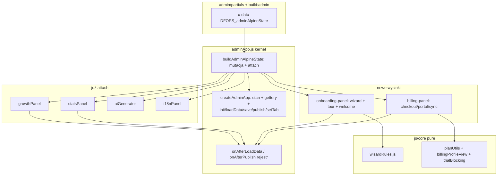

# Plan rozbicia adminApp.js (kernel + wycinki)

Dokument implementacyjny. **Zaakceptowany 2026-08-18** z trzema wetami CTO (rejestr hooków, predeklaracja stanu, gettery bez arrow). Źródło prawdy fali split panelu JS.

## 0. Werdykt (żeby recenzent nie zgadywał intencji)

**Cel tej fali:** nie „posiekać plik na mixiny”, tylko **wyjąć dwa pionowe wycinki produktowe** (onboarding/kreator oraz billing UI) i zostawić **kernel** jako composition root Alpine 3.

**Stan (2026-09-04):** fala zamknięta — PR-0…PR-4 na `staging`. Następne wycinki (domains / media / places) **nie** są tą falą.

**Poza zakresem tej fali:** auth, domeny, upload, Google Places, CRUD zakładek treści, appearance, multi-site, Vite/ESM. Zostają w kernelu.

**Twarde zakazy (z rollbacku i z działającego kodu):**

- `{ ...createAdminApp(), ...mixin }` — niszczy gettery Alpine 3 (wartości zamrażane w momencie spreadu).
- Mixiny per warstwa techniczna (`auth` / `ui` / `data` / `wizard`) — to był eksperyment z 2026-07-04.
- Bundler / `build:admin-js` / ESM — nie w tej fali (Roadmap Faza 1–2 zostaje na później).
- Edycja wygenerowanego [`admin.html`](../../admin.html) — źródło to [`admin/partials/`](../../admin/partials/) + `npm run build:admin`.

---

## 1. Fakty o molochu (stan 2026-08-13)

### 1.1 Rozmiar i kształt

- [`js/features/adminApp.js`](../../js/features/adminApp.js) — **4834 linie**, jeden IIFE, brak ESM.
- Alpine **3.13.3** (CDN, ładowany **po** `adminApp.js`).
- Wejście: `x-data="DFOPS_adminAlpineState()"` w [`admin/partials/02-body-open.html`](../../admin/partials/02-body-open.html).
- Brak bundlera JS panelu; kolejność `<script defer>` w [`admin/partials/01-head.html`](../../admin/partials/01-head.html).
- Testy panelu: praktycznie **zero** (`npm run test:ai-context` dotyczy `aiBusinessContext.js`). Brak E2E onboardingu — to była przyczyna rollbacku.

Struktura pliku:

```
1–702      helpery IIFE (auth copy, booking normalize, wizard storage, content shell, theme wrappers)
703–4757   createAdminApp() — jeden object literal ze stanem + getterami + metodami
4763–4828  buildAdminAlpineState() — mutacja obiektu + attach hooks (bez spreadu)
4830–4832  window.createAdminApp / DFOPS_adminAlpineState / DFOPS_createAdminContentShell
```

HTML jest już pocięty: ~39 partiali, `scripts/build-admin.mjs`. JS nie.

### 1.2 Co już jest poza monolitem (wzorzec do powielenia)

Attach (mutacja `app`, na końcu `buildAdminAlpineState`):

- `DFOPS_attachGrowthPanel` — [`js/features/growth/growthPanel.js`](../../js/features/growth/growthPanel.js)
- `DFOPS_attachStatsPanel` — dziś owija `setTab` + `loadData`; po PR-0: `setTab` (jedna warstwa, OK) + `onAfterLoadData` (rejestr)
- `DFOPS_attachAiGenerator`
- `DFOPS_attachI18nPanel` — dodaje m.in. `prepareContentForPersist` (kernel woła `typeof === 'function'`)

Domena już w `js/core/` (pure / adapter, bez Alpine): `planUtils.js`, `billingProfileView.js`, `trialBlocking.js`, `themeConfig.js`, `contentUpgrader.js`, `pageRepository.js`, `growthRules.js`, …

Kontrakt opisany w [`js/features/growth/README.md`](../../js/features/growth/README.md) i [`docs/specs/growth.md`](growth.md) §14. README już zapowiada `DFOPS_attachBillingPanel` i `DFOPS_attachWizardPanel`.

### 1.3 Lekcja rollbacku 2026-07-04 ([`docs/CONTEXT.md`](../CONTEXT.md) §4)

Co zrobiono wtedy: split na `js/features/admin/` (mixiny auth/billing/data/wizard/ui/integrations) + `build:admin-js` + **zamrażanie getterów w `init()`** i ręczne `syncBillingSubscriptionView` / `syncWizardView`.

Dlaczego padło: kreator + Driver.js niestabilne vs `main`; split **ujawnił** regresje (zamrożone gettery, tour pomijany przy auto-starcie), nie je usunął. Cofnięto tylko panel JS; HTML partials zostały.

**Wniosek operacyjny:** gettery Alpine muszą zostać **żywymi `get` na obiekcie przekazanym do `x-data`**. Nie wolno ich ewaluować przy składaniu obiektu. Nie wolno ich zastępować snapshotami pól.

### 1.4 Kernel Alpine, którego nie ruszamy koncepcyjnie

`buildAdminAlpineState` już dokumentuje zakaz spreadu:

```4763:4767:js/features/adminApp.js
  function buildAdminAlpineState() {
    const fromApp = createAdminApp();
    // Mutujemy oryginalny obiekt, aby zachować gettery (spread niszczyłby je przy inicjalizacji).
    fromApp.sidebarOpen = false;
```

Publiczne API HTML (zliczone z 39 partiali, 1278 wyrażeń Alpine): **258 unikalnych symboli** na obiekcie `x-data` — **107 metod** + **151 props/getterów**. Brak prefiksu `app.` — root Alpine **jest** aplikacją. 28 z 107 metod już pochodzi z attach (growth/stats/AI/i18n).

Gettery w `createAdminApp` — **52** (`get foo()`). HTML czyta je **bez `()`** (`x-show="hasActivePaidSubscription"`). W Alpine 3 metoda bez `()` jest truthy jako funkcja. **Dlatego gettery zostają na object literal kernela** w tej fali (nie `Object.defineProperty` w attach). Przykłady: `subscriptionPlan`, `isTrialPublicBlocked`, `wizardStepId`, `wizardStepCount`, `panelContentReady`, `isCustomDomainLocked`.

Jedyny `$watch`: głęboki `content` po `loadData` (autosave + `markLocaleCopyDirty`). Flagi: `_suppressContentWatch`, `isGeneratingAi`, `draftSaving`, `saving`.

### 1.5 Mapa odpowiedzialności w `createAdminApp` (przybliżone zakresy linii)

- **Boot / gettery przekrojowe:** 848–1760 (billing+trial+wizard+preview+account password hints pomieszane)
- **Toast / confirm / setTab:** 1469–1634
- **Billing akcje** (portal, checkout, Stripe sync, post-payment): 1775–2082, 3103–3793
- **Appearance / quick chat gating:** 2089–2274
- **Auth + `init` + `bootstrapAdminSession`:** 2278–2697
- **`loadData` (orkiestracja):** 2699–2925 — tu siedzi impersonacja, multi-site, upgrade content, billing, decyzja o wizardzie, `$watch`
- **Template switch:** 2957–3101
- **Wizard + Driver.js tour + welcome:** 3168–3632 + helpery 65–700
- **Domeny:** 3818–4020
- **Persist / publish / revert:** 4039–4318
- **Upload / galeria:** 4320–4458
- **Places / mapa / opinie Google:** 4460–4755

`loadData` **nie ma** haka. Growth i stats **owijają `loadData`** (cebula). PR-0 spłaca to rejestrem callbacków — **nie** pustą metodą do dalszego owijania.

---

## 2. Architektura docelowa (ta fala)



Trzy warstwy jak w Growth:

1. **`js/core/*Rules.js`** — pure functions, testowalne w Node, zero Alpine/Supabase UI.
2. **`js/features/<slice>/*Panel.js`** — `window.DFOPS_attachX(app)` mutuje `app`.
3. **Kernel** — stan kanoniczny + gettery HTML + lifecycle; na końcu `buildAdminAlpineState` woła attach.

**Świadoma decyzja (weto CTO 2026-08-18):** host jest źródłem prawdy. W tej fali **nie przenosimy getterów ani pól stanu** do attach.

- Slice dodaje **wyłącznie metody** (`app.foo = function foo() { ... }`).
- **Wszystkie klucze stanu** (także flagi UI wycinka: `checkoutLoading`, `turnstileWidgetId`, przyszłe pola onboardingu) zostają **predeklarowane** w object literal `createAdminApp()` z wartościami `null` / `false` / `''` / `[]`. Alpine 3 (Vue Proxy) widzi je od startu. Attach **nie** dopisuje nowych pól danych po fakcie.
- Growth/stats/AI/i18n historycznie dopisują pola w attach (factory, przed Proxy — działa). Nowych wycinków tak nie robimy; hoist istniejących pól do kernela jest opcjonalny, nie blokuje PR-0.

---

## 3. Kontrakt kernela (to, co zostaje w `adminApp.js`)

Kernel **musi** dalej eksportować (nazwy stabilne — HTML i istniejące attach-e od nich zależą):

**Lifecycle:** `init`, `bootstrapAdminSession`, `loadData`, plus **rejestr** (nie pusta metoda do wrapu):

```javascript
_afterLoadCallbacks: [],
_afterPublishCallbacks: [],
onAfterLoadData(fn) { if (typeof fn === 'function') this._afterLoadCallbacks.push(fn); },
onAfterPublish(fn) { if (typeof fn === 'function') this._afterPublishCallbacks.push(fn); },
```

Na końcu `loadData` (w `finally`, po `isLoading = false`):

```javascript
await Promise.all(this._afterLoadCallbacks.map(function (fn) { return fn.call(this); }, this));
```

Po **udanym** `publishChanges` (przed `return true`, nie przy błędzie): to samo dla `_afterPublishCallbacks`.

Callbacki: **zwykłe `function`**, nie arrow — `fn.call(this)` musi wstrzyknąć Proxy Alpine. Jeden padający callback nie może zabić reszty (try/catch per fn). Call stack zostaje płaski.

**Persist:** `saveActivePage`, `_persistDraft`, `scheduleDraftAutosave`, `autosaveDraftNow`, `saveData`, `publishChanges`, `revertChanges`. Nadal woła `prepareContentForPersist` / `_bindEditLocaleShim` jeśli są (i18n).

**Nawigacja / UX:** `setTab`, `showToast`, `showError`, `confirmAsync`, `confirmChoiceAsync`.

**Stan kanoniczny (pola):** `supabase`, `user`, `content`, `theme`, `slug`, `pageId`, `billingProfile`, `showWizard`, `wizardStep`, `wizardTheme`, `activeTab`, flagi loading/saving, impersonacja, `ownedPages`.

**Gettery** — zostają w object literal jako tradycyjne `get foo() { ... }`. **Zakaz arrow** (`get foo: () =>`) — Alpine musi wstrzyknąć `this` = swoje Proxy. Delegacja do `planUtils`: `return window.DFOPS_planAllowsCustomDomain(this.subscriptionPlan)` z żywego `this`.

**Auth, domeny, media, Places, appearance, template switch, account password, multi-site** — zostają.

Kernel po wycinkach: szacunek **~2800–3200 linii** (z ~4800), plus ~55 getterów. Nadal duży, ale **przestaje rosnąć w miejscach, gdzie najczęściej dokładamy kod** (kreator, Stripe).

---

## 4. Wycinek A — Onboarding = wizard + Driver.js + welcome

**Dlaczego jeden moduł, nie dwa:** rollback 2026-07-04 to była regresja **interakcji** tour ↔ kreator (auto-start, `onDestroyed` → `openWizardForBuilding`, pomijanie touru). Rozdzielenie wizard/onboarding odtworzy ten sam szew. Growth README mówi `wizard-panel` — tu **łączymy** w `js/features/onboarding/` (alias hooka: `DFOPS_attachOnboardingPanel`; w README dopisać że to jest zapowiadany wizard-panel).

**Do `js/core/wizardRules.js` (pure, testy Node):**

- stałe `WIZARD_STATE_VERSION`, storage key, `WIZARD_STEP_COUNT`
- `read/write/clearWizardStateFromStorage` (localStorage można wstrzyknąć w testach)
- `finalizeWizardContent`, placeholdery, `servicesMatchTemplate` / `menuItemsMatchTemplate` / `schedulesMatchTemplate`
- `validateWizardStep` jako czysta funkcja `(pl, theme, stepId) → errorString|null` — dziś jest metodą Alpine (~3168)

**Zostaje w kernelu jako pola/gettery:** `showWizard`, `wizardStep`, `wizardTheme`, `wizardFieldWarning`, `showWelcomeModal`, `showStudioWelcomeModal`, `showWizardDismissModal`, `wizardStepId`, `wizardStepCount`, `wizardOfferCopy`, `wizardTemplateCatalog`, `dashboardStartTasks`, `incompleteOnboardingChecks`, `shouldSkipFirstRunOnboarding`.

**Idzie do attach (metody):** `persistWizardUiState`, `restoreWizardUiFromStorage`, `validateWizardStep` (cienki wrapper), `startWizard`, `skipWizard`, `skipWizardSection`, `nextWizardStep`, `prevWizardStep`, `finishWizard`, `wizardAddServiceRow` / menu helpers, `openWizardForBuilding`, `openWizardFromStudio`, `reopenWizard`, `startOnboardingTour`, `markWelcomeOnboardingSeen`, `dismissWelcomeModalAndStartOnboarding` (jeśli jest), `closeStudioWelcomeModal`, `goToOnboardingItem`, `closeWizardDismissModal`.

**Host, którego onboarding potrzebuje:** `this.content`, `this.theme`, `this.slug`, `this.isEmailVerified`, `this.setTab`, `this.saveData`, `this.publishChanges`, `this.showToast`, `this.$nextTick`, `this.sidebarOpen`.

**Haki:** `app.onAfterLoadData(function onboardingAfterLoad() { this.maybeResumeOnboardingAfterLoad(); })`. Żadnego owijania `loadData`.

**HTML:** [`admin/partials/03-wizard.html`](../../admin/partials/03-wizard.html), fragmenty dashboard/welcome w [`07-modals-checkout-welcome.html`](../../admin/partials/07-modals-checkout-welcome.html) — **bez zmiany wiązań**, tylko JS się rusza.

**Szacunek przenosin:** ~900–1200 linii metod + ~400 linii helperów do `wizardRules.js`.

---

## 5. Wycinek B — Billing UI

Już w core: [`js/core/planUtils.js`](../../js/core/planUtils.js), [`js/core/billingProfileView.js`](../../js/core/billingProfileView.js), [`js/core/trialBlocking.js`](../../js/core/trialBlocking.js). Gettery kernela już z tego korzystają.

**Do attach [`js/features/billing-panel/billingPanel.js`](../../js/features/billing-panel/billingPanel.js):**

- `loadBillingProfile`, `syncStripeSubscription`, `syncUserPlanFromBilling`
- `subscribe` + checkout modal + Turnstile (`renderCheckoutTurnstile`, `clearCheckoutTurnstile`, `closeCheckoutModal`)
- `openCustomerPortal` / `openStripeCustomerPortal`, `schedulePostPaymentDataRefresh`, `schedulePostPortalBillingRefresh`
- `maybeShowPaymentReturnToast`, `maybeShowBillingStatusToastOnce`, `maybeSyncSubscriptionTabFromStripe`
- `dismissTrialSuspendedModal`, `syncTrialSuspendedModalVisibility`
- `dismissSubscriptionActivationBanner`
- `hasStripeBillingCustomer`, `shouldUseStripePortalForPlanChange`, `canOpenPortalPlanChangeFlow`, `subscriptionPaymentActive` — **uwaga:** część z nich to dziś metody (nie gettery); te z HTML-a bez `()` sprawdzić grepem zanim ruszymy. Jeśli HTML czyta je jak właściwość — zostawić na kernelu jako `get` albo cienką metodę-alias.

**Zostaje w kernelu:** pola `billingProfile`, `billingProfileReady`, `billingInterval`, gettery planu/trial/locków (`isCustomDomainLocked` itd. — używane też przez domeny i appearance, które zostają). `deleteAccount` zostaje w kernelu (account), czyta `subscriptionBlocksAccountDeletion`.

**Host:** `this.supabase`, `this.user`, `this.pageId`, `this.slug`, `this.content`, `this.isImpersonating`, `this.loadData`, `this.saveData`, `this.setTab`, `this.showToast`, `this.showError`.

**Haki:** `app.onAfterLoadData(function billingAfterLoad() { ... })`. `loadBillingProfile` dziś jest w `loadData`; wyniesienie do callbacku jest częścią PR-3, nie PR-0. Żadnego wrapu.

**HTML:** [`tab-subscription.html`](../../admin/partials/tab-subscription.html), [`06-modals-trial-upgrade.html`](../../admin/partials/06-modals-trial-upgrade.html), checkout w [`07-modals-checkout-welcome.html`](../../admin/partials/07-modals-checkout-welcome.html).

**Szacunek:** ~800–1100 linii.

---

## 6. PR-0 — rejestr lifecycle (obowiązkowy przed wycinkami)

**Weto 1:** pusta `afterLoadData()` do owijania tylko **przenosi cebulę**. Cztery moduły = cztery warstwy w call stacku. Kernel wystawia **Pub/Sub**.

**W kernelu** (pola w object literal `createAdminApp`, obok `_draftAutosaveTimer`):

```javascript
_afterLoadCallbacks: [],
_afterPublishCallbacks: [],
onAfterLoadData(fn) {
  if (typeof fn === 'function') this._afterLoadCallbacks.push(fn);
},
onAfterPublish(fn) {
  if (typeof fn === 'function') this._afterPublishCallbacks.push(fn);
},
async _runAfterLoadCallbacks() {
  const fns = this._afterLoadCallbacks.slice();
  await Promise.all(fns.map(function (fn) {
    try {
      return Promise.resolve(fn.call(this)).catch(function (err) {
        if (typeof console !== 'undefined' && console.debug) console.debug('[DFOPS onAfterLoadData]', err);
      });
    } catch (err) {
      if (typeof console !== 'undefined' && console.debug) console.debug('[DFOPS onAfterLoadData]', err);
      return undefined;
    }
  }, this));
},
```

Analogicznie `_runAfterPublishCallbacks`. Dispatch: koniec `loadData` `finally` (po `isLoading = false`); `publishChanges` tylko przy sukcesie.

**Growth / stats:** usunąć wrap `loadData` / `afterLoadData`. Zamiast tego:

```javascript
if (typeof app.onAfterLoadData === 'function') {
  app.onAfterLoadData(async function growthAfterLoad() {
    await this.loadGrowthData();
    this.refreshGrowthPriority();
  });
}
```

Stats: to samo z `maybeLazyLoadStats`. **Wrap `setTab` zostaje** (jeden moduł, jeden hak nawigacji — nie cebula).

**Weto 2 w PR-0:** `_afterLoadCallbacks` / `_afterPublishCallbacks` deklarowane w `createAdminApp`, nie dopisywane w attach. Nie ruszać istniejących pól growth/stats/AI w tym PR.

**Weto 3 w PR-0:** `onAfterLoadData` / `_runAfterLoadCallbacks` / callbacki attach = `function`, nie arrow.

**Pliki:** [`js/features/adminApp.js`](../../js/features/adminApp.js), [`js/features/growth/growthPanel.js`](../../js/features/growth/growthPanel.js), [`js/features/growth/statsPanel.js`](../../js/features/growth/statsPanel.js), [`js/features/growth/README.md`](../../js/features/growth/README.md), [`docs/specs/growth.md`](growth.md) §14.3, **ten spec**, [`docs/CONTEXT.md`](../CONTEXT.md) §1.4 + §4, bump `?v=` w [`admin/partials/01-head.html`](../../admin/partials/01-head.html) + `npm run build:admin`.

DoD: dashboard growth karta ładuje się po `loadData`; `#stats` / pierwsze `setTab('stats')` nadal leniwie fetchuje; call stack `loadData` bez N wrapperów; zero zmian UX.

---

## 6a. Trzy weta CTO (wiążące)

1. **Rejestr, nie wrap.** Zakaz `app.afterLoadData = async function (...args) { await prev.apply... }`. Tylko `onAfterLoadData(fn)` / `onAfterPublish(fn)` + `Promise.all` + `fn.call(this)`.
2. **Stan w object literal.** Attach nie robi `app.checkoutLoading = false`. Nowe pola (onboarding/billing) najpierw deklaracja w `createAdminApp`, potem metody w attach.
3. **Gettery i callbacki bez arrow.** `get isCustomDomainLocked() { return window.DFOPS_planAllowsCustomDomain(this.subscriptionPlan) === false; }` — `this` z Proxy Alpine.

---

## 7. Kolejność PR (każdy deployowalny na Staging)

Kolejność wynika z ryzyka regresji, nie z liczby linii.

1. **PR-0** — rejestr `onAfterLoadData` / `onAfterPublish` + growth/stats na rejestr + spec `docs/specs/admin-split.md` + CONTEXT. Manual: dashboard growth, tab stats, deep-link `#stats`.
2. **PR-1** — `js/core/wizardRules.js` + `scripts/test-wizard-rules.mjs` (storage versioning v1→v2, finalize, validate kroków per theme gastro/beauty). **Zero zmian Alpine.** `npm run test:wizard-rules`.
3. **PR-2** — `DFOPS_attachOnboardingPanel`: przeniesienie metod wizard/tour; kernel zostawia pola+gettery+1 wywołanie attach + `maybeResumeOnboardingAfterLoad`. Script w `01-head.html` **przed** `adminApp.js`. **Manual E2E obowiązkowe (to oblało poprzednio):**
   - nowa rejestracja → modal powitalny → Driver.js tour → kreator krok 1
   - skip sekcji offer/about, gastro bez about, finishWizard → pierwsza publikacja
   - reload w środku kreatora (localStorage v2)
   - impersonacja God Mode: kreator nie startuje źle
   - niepotwierdzony e-mail: kreator zablokowany
4. **PR-3** — `DFOPS_attachBillingPanel`: checkout, portal, sync, trial modal. Manual:
   - trial → Checkout Starter (Turnstile)
   - powrót `?payment=success` → toast + banner + `loadData`
   - zmiana planu przez portal gdy żywa sub
   - grant ręczny bez Stripe: karta + karuzela Checkout
   - God Mode impersonate: checkout zablokowany
   - `isTrialPublicBlocked` nadal steruje banerem (getter na kernelu)
5. **PR-4** — porządki (**zrobiony** 2026-09-04): usunąć martwe helpery z IIFE adminApp, bump `?v=` w head, wpis w CONTEXT §4, zaktualizować growth README (tabela kolejnych modułów: onboarding zrobiony, billing zrobiony; dalej: domains, media, places).

**Nie łączyć PR-2 i PR-3.** Jeśli staging znów rozjedzie onboarding, rollback dotyczy jednego wycinka.

---

## 8. Zasady implementacji (checklista dla agenta)

- Attach **mutuje** `app` **metodami**; nigdy spread, nigdy `Object.assign` z obiektu z getterami, nigdy nowych pól stanu w attach (weto 2).
- Nowe metody: `app.foo = function foo() { ... }` (named function — stacktrace; **nie arrow**).
- Gettery HTML zostają w `createAdminApp` object literal jako `get foo() { ... }` — **nie arrow** (weto 3).
- Guardy jak growth: `if (typeof this.saveData === 'function')`.
- Lifecycle: tylko `onAfterLoadData` / `onAfterPublish`. **Zakaz** owijania `loadData` / `afterLoadData` (weto 1). Wrap `setTab` przez stats — wyjątek, jeden moduł.
- Kolejność attach w `buildAdminAlpineState` bez znaczenia dla call stacku (rejestr, nie cebula); i tak: growth, stats, AI, i18n, potem onboarding, billing.
- Script tagi: core rules → panel slice → `adminApp.js` → Alpine (jak teraz).
- `createAdminContentShell` — kandydat do `contentSchema.js` w PR-1/2; nie blokuje wycinków.
- Po zmianie panelu: bump `?v=` skryptów; `npm run build:admin` jeśli ruszamy partials.
- CONTEXT.md §1.4 / §4 na końcu każdego PR z tej fali — mapa, nie diff.

---

## 9. Co zostaje w molochu (świadomy dług)

Po fali kernel nadal trzyma: auth (~500), `loadData` orkiestracja, persist, domeny, upload, Places/mapa (~400), appearance, template switch. **Następne wycinki (nie teraz):** `domains-panel`, `places-panel`, `media-panel`. Appearance gating (`isCustomAppearanceLocked`) zostaje na kernelu, bo czyta plan (getter) i jest używane w settings + publish.

Nie planujemy Vite, dopóki te trzy attach-e (growth już jest + 2 nowe) nie przeżyją tygodnia na Staging.

---

## 10. Protokół weryfikacji dla Gemini

Poproś recenzenta, żeby **obalił** plan, nie żeby go pochwalił. Pytania:

1. Czy którykolwiek krok znowu ewaluuje gettery przy składaniu obiektu (spread, `sync*View` snapshot, `Object.assign`)?
2. Czy wizard i Driver.js są w **jednym** wycinku? Jeśli nie — wskaż szew, który padł 2026-07-04.
3. Czy `loadData` jest owijany przez N modułów? Musi być **nie** — rejestr `onAfterLoadData` + `Promise.all`, płaski stack. Wrap `setTab` przez sam stats jest OK.
4. Czy HTML partials muszą zmienić `wizardStepId` / `hasActivePaidSubscription` na wywołania metod? Jeśli tak — plan jest zły.
5. Czy billing-gettery używane przez domeny/appearance zostają na hoście?
6. Czy jest ścieżka rollbacku per PR (tylko JS + 1 script tag), bez mieszania z migracjami DB?
7. Czy testy PR-1 pokrywają `WIZARD_STATE_VERSION` i gastro (inny zestaw kroków)?
8. Czy God Mode impersonate + niepotwierdzony e-mail są w DoD PR-2?
9. Czy Turnstile checkout i `HAS_STRIPE_SUBSCRIPTION` są w DoD PR-3?
10. Czy plan nie wciąga Vite/mixinów/big-bang `js/features/admin/`?

Weryfikacja CTO 2026-08-18: pytania 1, 2, 4–10 — TAK (plan bezpieczny). Pytanie 3 — TAK pod warunkiem weta 1 (rejestr, nie wrap `afterLoadData`). Zielone światło na PR-0 po wpisaniu wet do specu.

---

## 11. Artefakt `docs/specs/admin-split.md`

**Czat 0** zapisuje ten plan (z wetami + playbook) jako spec w repo. CONTEXT §1.4: link do specu. To jest plik, który wklejasz agentowi — nie czat.

---

## 12. Playbook agentów (nowy czat = jeden PR)

Zasada szybkości: **1 czat = 1 deployowalny PR**. Nie łączyć PR-2 z PR-3. Agent dostaje spec + rule, nie ten wątek.

Każdy prompt zaczyna się od bloku **Kontekst obowiązkowy**, potem **Zrób**, potem **Zakaz**, potem **DoD / grep**.

### Kontekst obowiązkowy (wklejaj na start każdego czatu)

```
Przeczytaj i przestrzegaj zanim cokolwiek zmienisz:
- docs/specs/admin-split.md (SoT tego refactoru)
- .cursor/rules/admin-split.mdc
- .cursor/rules/extract-before-grow.mdc
- docs/CONTEXT.md §1.5.2, §4 wpis 2026-07-04 (rollback mixinów)
- js/features/growth/README.md (wzorzec attach)

Cel: zero regresji UX. HTML partials bez zmiany wiązań (poza 01-head: nowy script + bump ?v=).
Nie edytuj admin.html ręcznie — tylko admin/partials/ + npm run build:admin.
Nie commituj, dopóki nie poproszę.
```

### Czat 0 — soczewki + spec (bez JS runtime)

**Po co:** obecny `extract-before-grow.mdc` mówi „nie wyciągaj na zapas” — agent w nowym czacie **odmówi** splitowi. Rule musi powstać **przed** PR-0.

**Zrób:**

1. Zapisz ten plan jako [`docs/specs/admin-split.md`](admin-split.md) (bez YAML frontmatter Cursor plana).
2. Dodaj [`.cursor/rules/admin-split.mdc`](../../.cursor/rules/admin-split.mdc) — treść z §13 poniżej (`globs` na pliki panelu, `alwaysApply: false`).
3. Patch [`.cursor/rules/extract-before-grow.mdc`](../../.cursor/rules/extract-before-grow.mdc): wyjątek — pionowy extract wg `docs/specs/admin-split.md` **jest** autoryzowany; nadal zakaz mixinów/spreadu/Vite.
4. Patch living-context: `docs/specs/admin-split.md` jest wyjątkiem od „nie twórz speców na task”.
5. CONTEXT §1.4 jedna linia + link do specu; §4 krótki wpis „start fali split panelu JS”.

**Zakaz:** zmiany `adminApp.js` / growth / stats.

**DoD:** nowe pliki istnieją; extract-before-grow nie blokuje PR-0–3.

---

### Czat 1 = PR-0 — rejestr hooków

**Zrób:**

1. W `createAdminApp` object literal: `_afterLoadCallbacks: []`, `_afterPublishCallbacks: []`, `onAfterLoadData`, `onAfterPublish`, `_runAfterLoadCallbacks`, `_runAfterPublishCallbacks` — **function**, nie arrow. Try/catch per callback.
2. `loadData` `finally` (po `isLoading = false`): `await this._runAfterLoadCallbacks()`.
3. `publishChanges` tylko przy sukcesie (przed `return true`): `await this._runAfterPublishCallbacks()`.
4. `growthPanel.js` + `statsPanel.js`: **usunąć** wrap `loadData`/`afterLoadData`. Zarejestrować `app.onAfterLoadData(async function name() { ... })`. Wrap `setTab` w stats **zostaje**.
5. Zaktualizować `growth/README.md` i `docs/specs/growth.md` §14.3 — przykłady wrapu zastąpić rejestrem.
6. Bump `?v=` w `01-head.html` dla `adminApp.js`, `growthPanel.js`, `statsPanel.js`. `npm run build:admin`.

**Zakaz:** przenoszenie pól growth/AI do kernela; nowa pusta `afterLoadData()` do owijania; spread.

**DoD (grep w nowym czacie):**

```
rg "app\\[(hookName|prevHook)" js/features/growth/   # 0 trafień wrapu loadData
rg "onAfterLoadData" js/features/adminApp.js js/features/growth/
rg "_afterLoadCallbacks" js/features/adminApp.js
```

Manual: dashboard karta growth po odświeżeniu; `#stats` i pierwsze kliknięcie Statystyki.

---

### Czat 2 = PR-1 — `wizardRules.js` + testy (zero Alpine)

**Zrób:** przenieś z IIFE `adminApp.js` (linie ~65–564) czyste funkcje do `js/core/wizardRules.js` (`window.DFOPS_*`). Kernel zostawia cienkie wrappery o tych samych nazwach lokalnych. Testy: `scripts/test-wizard-rules.mjs` na wzór `scripts/test-ai-business-context.mjs` (vm sandbox). `package.json`: `"test:wizard-rules"`.

Pokrycie testów: `WIZARD_STATE_VERSION` v1→v2 (krok ≥4); gastro bez about / `menu_items`; beauty `services`; `finalizeWizardContent`; `validateWizardStep` per `stepId`; read/write/clear storage z wstrzykniętym `localStorage`.

**Zakaz:** `DFOPS_attachOnboardingPanel`; zmiany HTML; zmiana zachowania kreatora.

**DoD:** `npm run test:wizard-rules` zielone; panel JS nadal działa (wrappery); bump `?v=` `adminApp.js` + nowy skrypt w `01-head.html` **przed** `adminApp.js`.

---

### Czat 3 = PR-2 — onboarding attach (największe ryzyko)

**Zrób:** `js/features/onboarding/onboardingPanel.js` + `window.DFOPS_attachOnboardingPanel`. Przenieś **tylko metody** z listy §4. Pola i gettery zostają w kernelu. `buildAdminAlpineState`: wywołanie attach. `onAfterLoadData` → `maybeResumeOnboardingAfterLoad`. Script w `01-head.html` przed `adminApp.js`. Kernel: usunąć ciała metod, zero duplikacji.

**Zakaz:** przenoszenie getterów `wizardStepId` / `dashboardStartTasks`; `app.showWizard = false` w attach jako nowa deklaracja (pole już jest w kernelu); owijanie `loadData`; zmiana `03-wizard.html` wiązań; rozdzielanie touru od wizarda.

**DoD grep:**

```
rg "async function startOnboardingTour|async finishWizard" js/features/onboarding/
rg "DFOPS_attachOnboardingPanel" js/features/adminApp.js admin/partials/01-head.html
```

Manual E2E (obowiązkowe — tu padł rollback): rejestracja → welcome → Driver.js → kreator krok 1; skip offer/about; gastro; finishWizard = publikacja; reload w środku kreatora; God Mode impersonate; niepotwierdzony e-mail blokuje kreator.

---

### Czat 4 = PR-3 — billing attach

Najpierw grep HTML: które z `hasStripeBillingCustomer` / `subscriptionPaymentActive` / `canOpenPortalPlanChangeFlow` są czytane **bez `()`**. Te zostają na kernelu jako `get` albo alias.

**Zrób:** `js/features/billing-panel/billingPanel.js` + `DFOPS_attachBillingPanel`. Metody z §5. Pola (`checkoutLoading`, `turnstileWidgetId`, `billingProfile`, …) **już są** w `createAdminApp` — nie inicjalizować ich w attach. Gettery planu/locków zostają na hoście.

**Zakaz:** ruszanie `deleteAccount` (zostaje w kernelu); ruszanie `isCustomDomainLocked` do attach; wrap `loadData`.

Manual: Checkout Starter + Turnstile; `?payment=success`; zmiana planu przez portal; grant ręczny bez Stripe; impersonate blokuje checkout; `HAS_STRIPE_SUBSCRIPTION`.

---

### Czat 5 = PR-4 — sprzątanie

Martwe helpery w IIFE jeśli PR-1/2 je zostawiły; growth README tabela (onboarding + billing zrobione); CONTEXT §4; bump `?v=` jeśli coś jeszcze.

**Zakaz:** Vite, `js/features/admin/` mixiny, `build:admin-js`.

---

### Szablon promptu (kopiuj, podmień CZAT / PR)

```
Jesteś agentem DFCMS. Realizujesz TYLKO [CZAT N / PR-X] z docs/specs/admin-split.md §12.
Nie ruszaj innych PR.

[wklej Kontekst obowiązkowy]

Zrób: [lista z §12 tego czatu]
Zakaz: [lista z §12]
DoD: [grep + test + manual]

Po skończeniu wypisz: diff plików, grep DoD, co muszę kliknąć na staging.
Nie commituj.
```

---

## 13. Audyt rules / soczewek

### Co już jest (OK, ale za wąskie)

- **[`extract-before-grow.mdc`](../../.cursor/rules/extract-before-grow.mdc)** (`alwaysApply`): attach, zakaz mixinów i spreadu, zakaz Vite. **Dziura:** punkt „Nie / wyciąganie na zapas” sprawi, że agent uzna ten split za zakazany — to **konflikt** z planem.
- **[`living-context.mdc`](../../.cursor/rules/living-context.mdc):** CONTEXT na koniec sesji. **Dziura:** „nie twórz speców na task” vs. `docs/specs/admin-split.md` (user poprosił — wyjątek).
- **`admin/README.md`:** nie edytuj `admin.html` — dobre, ale to nie jest Cursor rule (agent może nie czytać).
- **Skills:** supabase/cloudflare/stripe — **nie** pokrywają Alpine panelu. Nie blokują, nie pomagają.
- **`growth.md` §14.3:** nadal uczy **owijania** `afterLoadData` — agent skopiuje cebulę, dopóki PR-0 tego nie zmieni.

### Czego brakuje (Czat 0 musi dodać)

Nowe [`.cursor/rules/admin-split.mdc`](../../.cursor/rules/admin-split.mdc) — krótko, <50 linii, `alwaysApply: false`, globs:

`js/features/adminApp.js,js/features/growth/**,js/features/onboarding/**,js/features/billing-panel/**,js/features/i18nPanel.js,js/features/aiGenerator.js,admin/partials/**`

Treść rule (kopiuj 1:1 w Czat 0):

```
# Split panelu Alpine (adminApp)

SoT: docs/specs/admin-split.md. Wzorzec: js/features/growth/README.md.

## Nakaz
- Pionowy attach: window.DFOPS_attach*(app) mutuje app metodami (named function, nie arrow).
- Stan reaktywny TYLKO w createAdminApp() object literal (null/false/''/[]). Attach nie dopisuje pól.
- Gettery HTML zostają na kernelu: get foo() { ... } — this = Proxy Alpine. Zakaz arrow getters.
- Lifecycle: app.onAfterLoadData(fn) / onAfterPublish(fn). Kernel Promise.all + fn.call(this).
- Nowe skrypty: <script defer> w admin/partials/01-head.html PRZED adminApp.js, PRZED Alpine. Bump ?v=. Potem npm run build:admin.

## Zakaz
- { ...createAdminApp(), ...mixin } i Object.assign z getterami
- js/features/admin/ mixiny, build:admin-js, Vite/ESM w tej fali
- Owijanie loadData / afterLoadData (cebula). Wyjątek: stats może owijać setTab.
- Edycja wygenerowanego admin.html
- Zmiana nazw symboli z HTML (258 publicznych) bez zmiany partiali
- Rozdzielanie Driver.js touru od wizarda
```

Patch `extract-before-grow.mdc` — dopisać pod „Tak”:

```
- Autoryzowany extract istniejącego kodu wg docs/specs/admin-split.md (onboarding, billing) — to nie jest „na zapas”
```

i pod „Referencja”: `docs/specs/admin-split.md`, `.cursor/rules/admin-split.mdc`.

### Świadomie nie dodajemy

- Osobnego skillu Stripe/Supabase pod ten split — billing UI nie rusza Edge.
- `alwaysApply: true` na admin-split — nie zaśmiecać czatów poza panelem.
- E2E automatycznego (Playwright) w tej fali — rollback był od braku testów, ale najpierw rejestr + czyste `wizardRules`; E2E to osobny epik po PR-2 na Staging.
