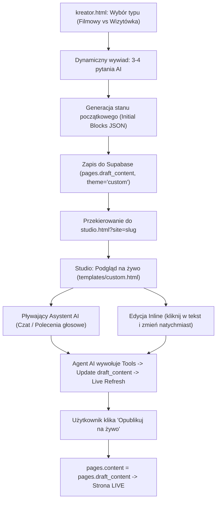

# Specyfikacja: Custom AI Sites (Strona Filmowa & Szybka Wizytówka)

> **Status:** Wdrożenie fazy MVP (2026-09)  
> **Kontekst:** Rozszerzenie DFCMS o nieszablonowe witryny customowe, w których rolę CMS-a pełni Agent AI (Tool-Calling) operujący na uniwersalnym silniku blokowym.

---

## 1. Cel i Założenia Architektoniczne

DFCMS posiada 6 sztywnych szablonów branżowych (`beauty`, `consultant`, `fitness`, `services`, `gastro`, `care`). Klienci poszukujący witryn niestandardowych (zwłaszcza **twórcy wideo/filmowcy** oraz osoby potrzebujące **błyskawicznej wizytówki konwersyjnej**) wymagają elastyczności, której sztywne szablony nie oferują.

Zamiast budować kolejny skomplikowany panel z dziesiątkami formularzy, moduł Custom AI wprowadza paradygmat:
1. **Brak tradycyjnego CMS-a (Zero-CMS):** Interfejsem zarządzania jest **Czat z Agentem AI** zintegrowany z **Podglądem na Żywo (Live Preview)** i szybką edycją tekstu w miejscu (**Inline Edit**).
2. **Determinizm i Integralność:** AI **nie** generuje surowego kodu HTML. Agent posługuje się zdefiniowanymi narzędziami (**Gemini Function Calling**), które wykonują atomowe operacje na zwalidowanym drzewie bloków JSON.
3. **Kompatybilność z DFCMS:** Strona korzysta z tabeli `pages` (`theme = 'custom'`), zachowuje separację `draft_content` / `content`, mechanizm publikacji jednym kliknięciem oraz infrastrukturę domenową Cloudflare for SaaS.

---

## 2. Dedykowane Archetypy Witryn

### A. Typ: Filmowy / Cinematic Portfolio (`theme_type: 'cinematic'`)
Dedykowany dla reżyserów, operatorów (DOP), montażystów, kolorystów, domów produkcyjnych i twórców wideo.
- **Wideo w tle (Hero):** Autoplay loop (wyciszone) zoptymalizowane pod urządzenia mobilne, obsługa Vimeo, YouTube, Cloudflare Stream oraz plików bezpośrednich MP4.
- **Modal Showreel:** Odtwarzacz w oknie popup z pełną kontrolą dźwięku i jakości.
- **Siatka realizacji (Projects Grid):** Kafelki z miniaturami, tytułem projektu, rolą (np. „Director & DOP”), klientem/marką i rokiem.
- **Pasek nagród / festiwali (Awards Strip):** Wyróżnienia branżowe (np. Camerimage, Fryderyki, Grand Video Awards).
- **Bio / Art Statement:** Zwięzłe bio z manifestem artystycznym i podpisem.
- **Minimalistyczny kontakt:** Telefon, e-mail, agencja / impresariat, Instagram, Vimeo.

### B. Typ: Szybka Wizytówka (`theme_type: 'quick_card'`)
Dedykowany dla rzemieślników, fachowców, konsultantów i lokalnych usług, gdzie kluczowy jest natychmiastowy kontakt (ładowanie < 1s, cel: telefon/WhatsApp).
- **Hero konwersyjne:** Jasne hasło, czym się zajmujesz, obszar działania (miasto), natychmiastowe przyciski CTA [Zadzwoń teraz] i [Napisz na WhatsApp].
- **3 Kluczowe atuty / usługi:** Trzy zwięzłe klocki wartości bez lania wody.
- **Bezpośredni kontakt & Mapa:** Klikalny telefon, nawigacja do adresu, godziny pracy, opcjonalny terminarz Booksy/Calendly.

---

## 3. Schemat Danych: Silnik Blokowy (`draft_content` / `content`)

W rekordzie `pages` dla `theme = 'custom'`:

```json
{
  "theme_type": "cinematic",
  "design": {
    "palette": "dark_gold",
    "font_theme": "cinematic_sans",
    "accent_color": "#D4AF37",
    "bg_color": "#0d0d0d"
  },
  "meta": {
    "title": "Jan Kowalski — Reżyser & Operator",
    "description": "Portfolio reżysera i operatora obrazu. Reklamy, teledyski i formy dokumentalne."
  },
  "blocks": [
    {
      "id": "hero_cinematic_1",
      "type": "cinematic_hero",
      "data": {
        "title": "Jan Kowalski",
        "subtitle": "Director & Cinematographer",
        "tagline": "Emocje ubrane w światło i ruch",
        "video_provider": "vimeo",
        "video_id": "76979871",
        "video_loop_url": "",
        "showreel_url": "https://vimeo.com/76979871",
        "cta_text": "Zobacz Showreel",
        "cta_secondary_text": "Projekty",
        "cta_secondary_target": "#projekty"
      }
    },
    {
      "id": "projects_1",
      "type": "projects_grid",
      "data": {
        "heading": "Wybrane Realizacje",
        "subheading": "Reklamy · Teledyski · Formy Krótkie",
        "items": [
          {
            "id": "p1",
            "title": "BMW — The Drift",
            "category": "Reklama",
            "role": "Reżyseria / Zdjęcia",
            "video_url": "https://vimeo.com/76979871",
            "thumbnail": "https://images.unsplash.com/photo-1503376780353-7e6692767b70?auto=format&fit=crop&w=800&q=80"
          }
        ]
      }
    },
    {
      "id": "awards_1",
      "type": "awards_strip",
      "data": {
        "heading": "Festiwale i Nagrody",
        "items": [
          { "name": "Camerimage 2025", "desc": "Złota Żaba — nominacja" },
          { "name": "Fryderyk 2024", "desc": "Teledysk Roku" }
        ]
      }
    },
    {
      "id": "contact_1",
      "type": "minimal_contact",
      "data": {
        "heading": "Współpraca",
        "subheading": "Dostępny do realizacji komercyjnych i fabularnych w Polsce i Europie.",
        "phone": "+48 600 700 800",
        "email": "kontakt@jankowalski.film",
        "instagram": "https://instagram.com/jankowalski",
        "vimeo": "https://vimeo.com/jankowalski",
        "location": "Warszawa / Cały świat"
      }
    }
  ]
}
```

---

## 4. Narzędzia Agenta AI (Gemini Function Calling Tools)

Agent w Edge Function `chat-site-agent` operuje wyłącznie za pomocą narzędzi:

1. `update_block_data({ blockId, path, value })` – aktualizacja pojedynczego pola (np. `phone`, `title`).
2. `add_block({ afterBlockId, blockType, initialData })` – wstawienie nowego klocka w zadanym miejscu.
3. `remove_block({ blockId })` – usunięcie klocka.
4. `reorder_blocks({ orderedIds })` – zmiana kolejności sekcji na stronie.
5. `update_design({ palette, accentColor, fontTheme })` – modyfikacja stylistyki globalnej.

---

## 5. Przepływ Użytkownika (User Flow)



---

## 6. Bezpieczeństwo, Transparentność AI i Zgodność Prawna

1. **Zasada Human-in-the-loop:** Agent AI edytuje wyłącznie wersję roboczą (`draft_content`). Żadna zmiana zasugerowana przez AI nie trafia do domeny publicznej (`content`) bez świadomej autoryzacji i kliknięcia „Opublikuj na żywo” przez właściciela strony.
2. **Transparentność i Oznaczenie AI (EU AI Act):** Publiczne witryny na planach trial / tier0 posiadają badge `⚡ Stworzono w DFCMS AI` informujący o platformie generującej. W kodzie i formularzach użytkownik jest jednoznacznie informowany, że asystent Studio jest modelem językowym (Gemini).
3. **Prywatność i Osadzanie Treści (RODO):**
   - Filmy YouTube osadzane są wyłącznie przez subdomenę privacy-enhanced `www.youtube-nocookie.com` z parametrem `rel=0`.
   - Filmy Vimeo osadzane są z nagłówkiem `dnt=1` (Do Not Track).
   - Brak skryptów śledzących third-party w bazowym szablonie `custom.html`.
   - Rejestracja i tworzenie witryn zabezpieczone są weryfikacją anty-botową Cloudflare Turnstile (fail-closed poza środowiskiem lokalnym).
4. **Determinizm Danych i Ochrona Przed Atakami:**
   - AI nie renderuje kodu HTML ani JS — generuje wyłącznie parametry dla zdefiniowanych bloków JSON.
   - Narzędzia mutujące (`setDeepValue`) weryfikują klucze i blokują ataki typu prototype pollution (`__proto__`, `constructor`, `prototype`).
   - Pola adresowe przechodzą przez sanityzację odrzucającą protokoły `javascript:`, `data:` oraz `vbscript:`.

