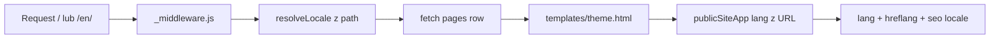

# i18n

> Plan architektoniczny dla agentów i product. Stan produkcji: [`CONTEXT.md`](../CONTEXT.md).  
> **Nie mylić** z tłumaczeniem UI panelu DFCMS (osobny epik).

**Ostatnia aktualizacja:** 2026-07-23  
**MVP i18n:** `pl` (domyślny) + `en` + `de` (allowlista). Panel: Standard+ do 3 locale łącznie.

---

## 1. Cel

Jeden rekord `pages`, wiele języków treści, **osobne URL-e pod SEO**, AI generuje lub adaptuje copy per locale — bez utraty jakości obecnego generatora AI, draft/publish i Silnika Wzrostu.

## 2. Decyzje (zamknięte)

| Temat | Decyzja |
|--------|---------|
| Model | Jeden `pages` row; copy w `locales.{code}`; fakty/ustawienia w `shared` |
| URL | Path prefix: default **bez** prefixu (`/`); inne `/en/...` |
| SEO | `html lang`, `hreflang` + `x-default`, osobne `seo.*` per locale, sitemap × locale |
| Wybór języka | **Tylko URL** (nie `navigator.language` na tym samym path — dziś public tak robi, to regresja SEO do usunięcia) |
| AI | `generate` w locale **lub** `adapt` z locale źródłowego (zwykle PL → EN); ten sam whitelist co AI Site Generator |
| Plany | Starter: tylko PL; Standard / Custom: PL + EN (limit w `planUtils`) |
| Panel | Przełącznik „Edytujesz: PL \| EN”; shared poza przełącznikiem |
| Poza scope v1 | Osobny `pages` per język; `?lang=`; widget GT; subdomena `en.*`; tłumaczenie admin UI |

## 3. Stan wyjściowy

- Treść już pod `content.pl.*` — naturalny slot locale.
- [`js/features/publicSiteApp.js`](../../js/features/publicSiteApp.js): `this.lang`, `content?.[lang]?.seo`, wybór `navigator.language` jeśli istnieje klucz w content — **zalążek i18n, zły pod SEO** (ten sam URL ≠ ten sam język).
- `pl.settings` miesza konfigurację z treścią — przy i18n trzeba rozdzielić.
- Routing: [`functions/_middleware.js`](../../functions/_middleware.js); brak segmentu locale.
- AI: [`supabase/functions/generate-ai-content`](../../supabase/functions/generate-ai-content/) + `_shared/aiCopySchemas.ts`.

## 4. Docelowy kontrakt JSON

```text
draft_content / content
├── meta: { defaultLocale: "pl", locales: ["pl","en"] }
├── shared: {
│     settings,     // booking, analytics, growth, colors, flags sekcji…
│     contact: { phone, email, address, booking_*, map_*, whatsapp, messenger },
│     social, media / gallery.images, google_reviews.place_* / embed techniczny
│   }
└── locales:
    ├── pl: { nav, hero, manifesto, services, faq, seo, contact.cta texts, … }
    └── en: { … ten sam kształt copy … }
```

**Zasady**

- **Shared** = fakty, URL-e, media, settings — nie tłumaczone.
- **Locale** = copy, etykiety nav, `seo.title` / `description`, lokalne teksty CTA.
- **Legacy:** `content.pl` przy load → `locales.pl` + wyniesienie `settings` / kontaktu technicznego do `shared` w [`contentUpgrader.js`](../../js/core/contentUpgrader.js).
- **Przejście:** normalizacja przy każdym load (panel + public), żeby nie robić search-replace big-bang na wszystkich `content.pl` w HTML naraz. Opcjonalnie cienki getter `lc` / `localeContent` w Alpine.

## 5. SEO i routing



1. `/` → `defaultLocale` (PL); `/en`, `/en/polityka-prywatnosci` → `en`.
2. Nieznany kod locale w path → **404** (bez soft-serve PL pod `/xx` — unikamy duplikatów).
3. Middleware: wyłuskaj locale, strip segmentu przed theme routes; przekaż locale do boot (np. `data-dfcms-locale` / query wewnętrzny spójny z preview).
4. Public: **`lang` wyłącznie z URL/boot**, nie z `navigator.language`.
5. Brak opublikowanego EN: `/en` → 404 lub redirect 302 na `/` (preferencja v1: **redirect na default**, z `hreflang` tylko dla włączonych locale).
6. `hreflang` + `x-default` (zwykle PL) w SEO rewriter i/lub `applyDocumentSeo`.
7. Sitemap: slug × włączone locale.
8. Switcher PL | EN na witrynie tylko gdy `meta.locales.length > 1`.

## 6. AI

Rozszerzenie `generate-ai-content` (lub cienka `translate-ai-content`):

| Pole body | Znaczenie |
|-----------|-----------|
| `locale` | Docelowa gałąź `locales[locale]` |
| `mode` | `generate` \| `adapt` |
| `sourceLocale` | Dla `adapt` (default `pl`) |
| `prompt` | Opcjonalny kontekst przy generate; przy adapt można pominąć |

- Zapis **tylko** copy locale; shared nietknięty (telefon itd. jak dziś).
- Quota: adapt = 1 generacja (ta sama pula miesięczna).
- Prompt adapt: naturalny język docelowy, lokalizacja pod rynek, bez korpo-kalki, ten sam `responseSchema` z `aiCopySchemas`.

## 7. Panel

1. `editLocale`, `enabledLocales` z `meta`.
2. Przełącznik w headerze / Dashboard — edycja `locales[editLocale]`.
3. Shared (Wygląd, Subskrypcja, fakty Kontaktu) — poza przełącznikiem.
4. AI: „Generuj w tym języku” + „Zlokalizuj z PL → EN”.
5. `DFOPS_planAllowsExtraLocales(plan)` — Standard / Custom; Starter = upsell.

## 8. Fazy

### L0 — Kontrakt + upgrader (bez UI i18n)

- `meta` / `shared` / `locales` w contentSchema + contentUpgrader.
- Load: legacy → nowy kształt; wygląd PL bez zmian.
- Smoke: panel, public, publish, growth settings, booking.

**DoD:** brak regresji PL; nowy kształt w DB po save.

### L1 — Public URL + SEO

- Path locale + middleware + `publicSiteApp` (usuń wybór po `navigator.language` jako SoT).
- hreflang, `html lang`, sitemap, switcher gdy EN włączony.

**DoD:** `/` = PL; `/en` działa gdy EN jest; preview respektuje locale.

### L2 — Panel switcher

- Helper dostępu do locale copy; przełącznik; gate planu.

**DoD:** właściciel Standard edytuje EN draft i publikuje.

### L3 — AI per locale

- Edge `mode` + UI adapt/generate; merge tylko `locales[locale]`.

**DoD:** „Zlokalizuj z PL” wypełnia EN; quota/plan OK.

### L4 — Polish

- Privacy template EN; więcej locale; soft-fallback stringów (opcjonalnie).
- Wpisy w ROADMAP + CONTEXT § dziennik.

## 9. Testy (L1–L3)

1. Stara strona tylko PL — zero zmian UX.
2. EN włączony — `/en` + hreflang w źródle strony.
3. Starter nie dodaje EN (upsell).
4. AI adapt nie nadpisuje shared kontaktu.
5. Publish: LIVE z obu locale; draft nie widać publicznie.
6. `dfcms_preview=1` + `/en` = podgląd EN.
7. Ten sam path nie serwuje różnej treści zależnie od języka przeglądarki.

## 10. Ryzyka

- Dużo `content.pl` w partialach admina — warstwa `lc` / normalizacja, nie big-bang replace.
- Błąd migracji `settings` → utrata growth/booking — checklista L0 obowiązkowa.
- Zły hreflang / ten sam content pod dwoma URL — trzymać path-prefix + tylko włączone locale w sitemap.

## 11. Pliki (orientacyjnie)

| Obszar | Pliki |
|--------|--------|
| Kontrakt | `js/core/contentSchema.js`, `contentUpgrader.js`, `js/templates/registry.js` |
| Public | `js/features/publicSiteApp.js`, `templates/*.html`, `functions/_middleware.js`, `functions/sitemap.xml.js` |
| Panel | `admin/partials/*`, `js/features/adminApp.js`, nowy `js/features/i18nPanel.js` (attach hook) |
| Plany | `js/core/planUtils.js` |
| AI | `supabase/functions/generate-ai-content/`, `_shared/aiCopySchemas.ts` |
| Docs | ten plik, `docs/CONTEXT.md`, `docs/ROADMAP.md` |
